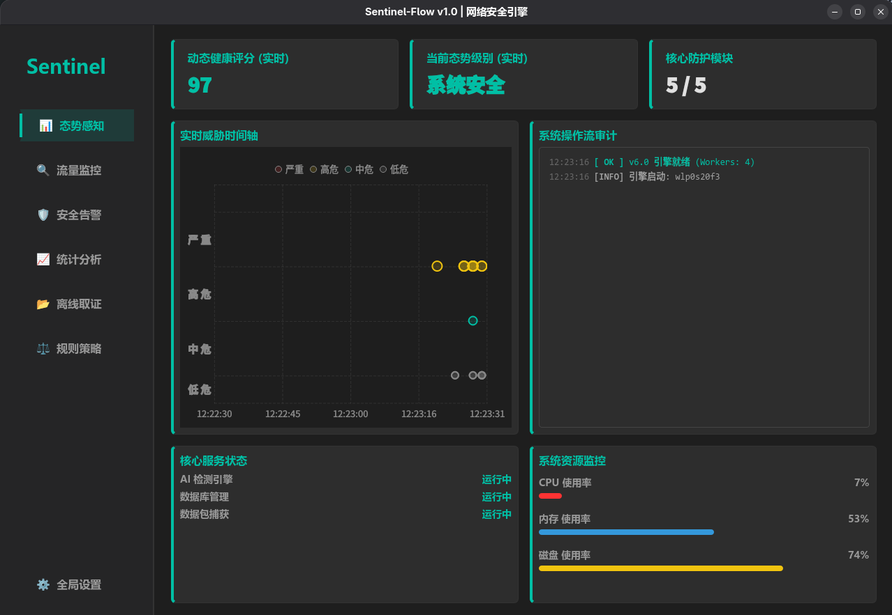
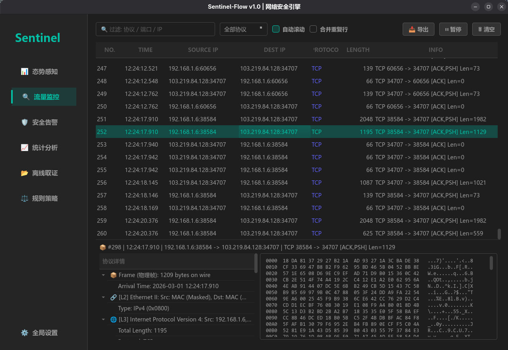
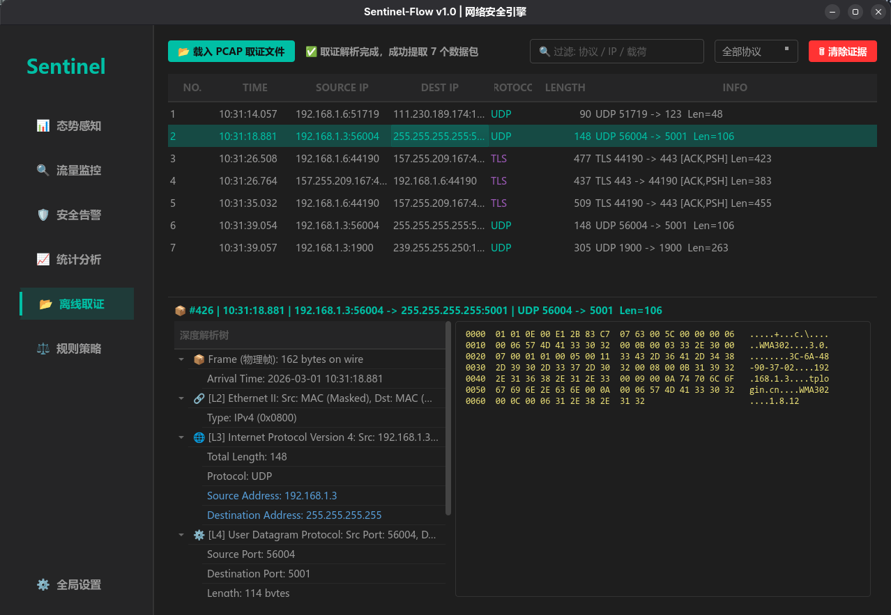
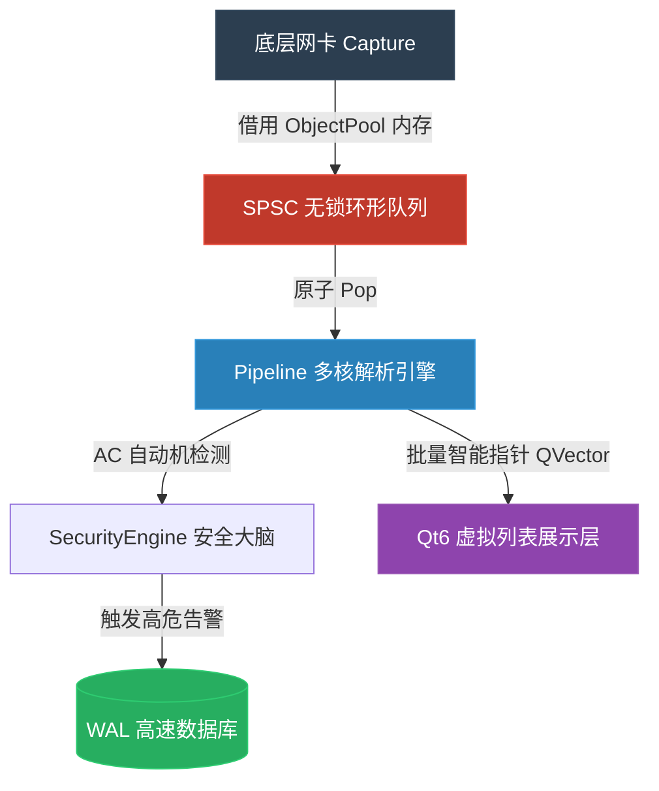

# Sentinel-Flow : 高性能网络流量分析与防御系统


<p align="center">
  
  
  
  
</p>


## 项目简介

Sentinel-Flow 是一款专为高并发、低延迟场景打造的**网络流量分析 (NTA) 与入侵检测 (IDS) 系统**。
系统采用 **C++20** 标准开发，底层基于 `libpcap` 与自研的无锁并发架构（Hyper-Exchange），能够在普通的 x86 服务器上实现万兆 (10Gbps+) 线速流量的深度包检测 (DPI) 与防御阻断。前端基于 **Qt6** 构建，提供媲美 Wireshark 的专业级交互体验。

无论是作为网络安全监控中枢，还是作为离线恶意流量取证工具，Sentinel-Flow 都能提供极具确定性的性能表现。

---

## 视觉与交互体验 (Screenshots)


<details>
<summary><b>1. 态势感知大屏 (Dashboard)</b> - 实时波形图与威胁雷达</summary>

</details>


<details>
<summary><b>2. 万兆实时监控 (Traffic Monitor)</b> - 60FPS 虚拟列表与 L7 智能嗅探</summary>

</details>


<details>
<summary><b>3. 离线深度取证 (Forensic Analysis)</b> - Wireshark 级协议解析树与 16 进制转储</summary>

</details>


---

## 特性 (Core Features)

- **无锁并发 (Lock-Free Architecture)**
  - 彻底抛弃传统的 `std::mutex`。基于 C++20 `std::atomic` 构建单生产者单消费者 (SPSC) 无锁环形队列。
  - 引入混合自旋退避策略 (Hybrid Backoff)，配合 CPU 亲和性绑定，消除线程上下文切换与 Cache Bouncing 开销。
- **O(N) 匹配 (Aho-Corasick IDS)**
  - 废弃低效的正则引擎，底层重写 AC 自动机状态机，支持上万条Snort级别入侵规则的 $O(N)$ 复杂度并发扫描。
- **零拷贝内存池 (Zero-Copy Memory Pool)**
  - 实现基于无锁链表的 `ObjectPool`。从网卡内核态到前端 Qt 视图层，数据包的物理内存全程“零拷贝”流转，彻底消灭洪峰流量下的 OOM (内存溢出) 危机。
- **类 Wireshark 视图渲染 (Protocol Dissection)**
  - 前端基于 MVC 架构深度解耦，封装 `PacketDetailRenderer` 引擎。支持 L2-L7 层级协议树展开、十六进制/ASCII 标准转储，以及 HTTP/SSDP 等明文协议的智能嗅探。
- **优雅的系统级提权 (Linux Capabilities)**
  - 摒弃粗暴的 Root 启动。首创交互式 CLI/GUI 双模引导流，通过动态写入 `cap_net_raw` 并调用 `execv` 安全重载进程镜像，完美规避 Wayland/X11 显示服务器与 SELinux 沙箱冲突。
- **跨平台优雅降级 (Cross-Platform)**
  - 依托 C++ 预处理器宏隔离 Linux 专属内核 API。在 macOS / Windows 平台编译时，系统将智能降级为纯净的“离线取证分析模式”。

---

## 系统架构 (Hyper-Exchange Architecture)

数据流向严格遵循**单向数据流与零拷贝**原则：



------

## 构建与安装

### 1. 环境依赖 (以 Fedora Linux 为例)

```bash
sudo dnf install -y qt6-qtbase-devel qt6-qtcharts-devel libpcap-devel sqlite-devel cmake gcc-c++
```

### 2. 极速编译

项目采用 CMake 构建，默认全量开启 `-O3` 优化：

```Bash
mkdir build && cd build
cmake -DCMAKE_BUILD_TYPE=Release ..
make -j$(nproc)
```

## 运行与权限策略

Sentinel-Flow 遵循**最小权限原则 (Principle of Least Privilege)**。 直接以普通用户身份运行编译出的二进制文件即可，**系统会自动唤起引导菜单并请求动态提权**：

```Bash
./cmake-build-debug/SentinelApp
```

**交互式引导流体验：**

1. 系统提示选择 `[1] GUI 图形大屏` 或 `[2] CLI 终端守护进程`。
2. 探测到底层网卡特权缺失，系统自动拦截并弹出提权询问 `[Y/n]`。
3. 输入本地用户密码后，系统通过 `setcap` 注入网卡嗅探特权，瞬间热重载并进入万兆监控模式。
4. *(若拒绝提权或在非 Linux 系统运行，将自动进入安全的离线 PCAP 分析模式)*。

## 数据与存储

- **高性能日志**：采用 SQLite WAL (Write-Ahead Logging) 模式，最高支持每秒万级告警落盘，存储于全局共享特权区隔离保护。
- **取证文件**：触发严重威胁 (Critical) 时，系统将自动基于内存池数据在 `./evidences/` 目录下生成可供第三方溯源的 `.pcap` 证据文件。