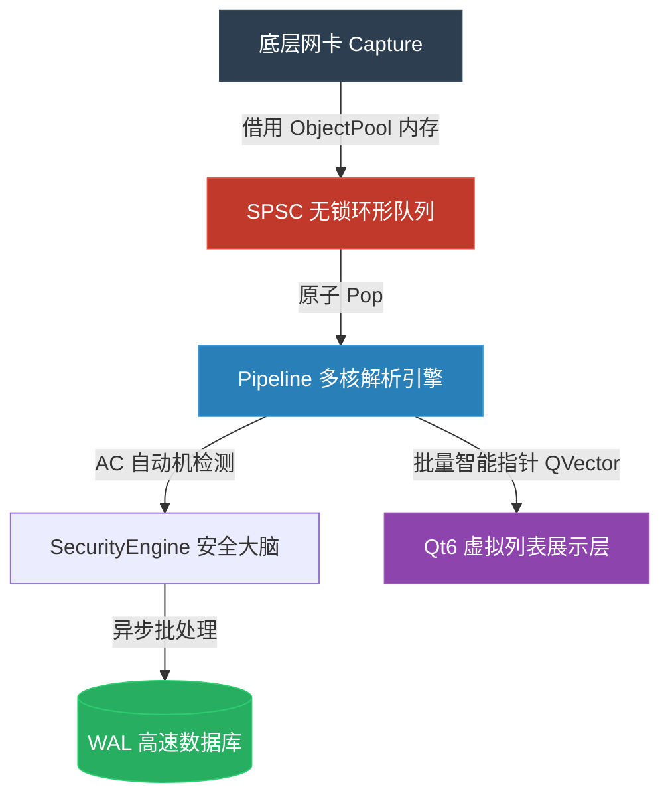

# Sentinel-Flow : 高性能网络流量分析与防御系统

<p align="center">
  
  
  
  
</p>

## 项目简介

Sentinel-Flow 是一个网络流量分析与入侵检测系统。
底层基于 C++20 与 `libpcap`，采用单生产者单消费者无锁队列进行跨线程数据调度；前端基于 Qt6 构建视图层。系统设计侧重于减少热路径上的内存分配与系统调用，以支持高吞吐量环境下的流量检测与分析。

---

## 视觉交互

<details>
<summary><b>1. 态势感知大屏</b> - 实时波形图与统计雷达</summary>

</details>

<details>
<summary><b>2. 实时流量监控</b> - 虚拟列表与业务层探测</summary>

</details>

<details>
<summary><b>3. 离线流量取证</b> - 协议树与 16 进制数据转储</summary>

</details>

---

## 核心特性

- **极低延迟的无锁流水线**
  - 弃用常规锁机制，底层基于 `std::atomic` 与内存序 (`acquire/release`) 构建单生产者单消费者环形队列。通过 `alignas(64)` 隔离读写游标消除伪共享，消费侧实装 Spin-Yield-Sleep 混合退避机制。
- **抗 OOM 的零拷贝内存池**
  - 基于 Tagged Pointer 机制实现无锁空闲链表。结合自定义 Deleter 的 `std::unique_ptr`，数据包物理内存从捕获探针到 Qt 虚拟列表视图实现全链路生命周期托管。
- **多模式特征匹配**
  - 采用 Aho-Corasick 自动机替代正则表达式。树节点使用大小为 256 的数组进行 $O(1)$ 状态转移，匹配时间复杂度仅与数据包载荷长度成正比，独立于装载的规则数量。
- **视图与数据解析解耦**
  - 业务逻辑与 UI 渲染分离。解析后的数据被组装为 `QVector`，通过 Qt 的跨线程事件队列传递给虚拟列表模型，避免界面重绘阻塞数据面管线。
- **动态提权与进程重载**
  - 启动时探测 `AF_PACKET` 权限。若缺乏特权，则通过 `fork` 调起 `sudo setcap cap_net_raw,cap_net_admin=eip` 赋予二进制文件 Capabilities，随后调用 `execv` 重载进程镜像，避免直接以 root 运行引发的 GUI 显示拒绝问题。
- **跨平台与离线模式**
  - 启动支持 `--cli` 和 `--gui` 模式切换。通过 `#ifdef __linux__` 隔离系统调用。在无网卡权限或非 Linux 环境下，系统跳过物理接口绑定，退化为纯 `.pcap` 文件解析模式。

---

## 系统架构 (Hyper-Exchange Architecture)

数据流向严格遵循**单向数据流与零拷贝**原则：



------

## 构建与安装

### 1. 环境依赖 (以 Fedora Linux 为例)

```bash
sudo dnf install -y qt6-qtbase-devel qt6-qtcharts-devel libpcap-devel sqlite-devel cmake gcc-c++
```

### 2. 极速编译

项目采用 CMake 构建，默认全量开启 `-O3` 优化：

```Bash
mkdir build && cd build
cmake -DCMAKE_BUILD_TYPE=Release ..
make -j$(nproc)
```

## 运行与权限策略

Sentinel-Flow 遵循**最小权限原则 (Principle of Least Privilege)**。 直接以普通用户身份运行编译出的二进制文件即可，**系统会自动唤起引导菜单并请求动态提权**：

```Bash
./cmake-build-debug/SentinelApp
```

**交互式引导流体验：**


1. 选择 [1] GUI 图形大屏 或 [2] CLI 终端守护进程。 
2. 若探测到底层网卡特权缺失，系统请求提权。 
3. 输入密码后，系统通过 setcap 注入网卡嗅探特权并热重载。
4. (若拒绝提权或在非 Linux 环境，将进入离线 PCAP 分析模式)。

## 数据与存储

- 异步持久化：采用 SQLite WAL (Write-Ahead Logging) 模式配合 synchronous=NORMAL。引擎层触发的告警通过独立的 Worker 线程与 std::condition_variable 队列进行异步落盘，以 BEGIN IMMEDIATE/COMMIT 聚合千条事务，避免 I/O 阻塞主解析流水线。

- 内存防洪：告警存储队列硬编码 20,000 条背压上限，防止恶劣网络环境下的级联 OOM 崩溃。

## 文档导航

详细的架构原理、数据流与运维指南，请参阅 `docs/` 目录：

- 🧠 **[核心架构说明](docs/architecture/ARCHITECTURE.md)**：包含总体架构图、并发模型与 CPU 亲和性策略。
- 🔄 **[数据生命周期](docs/architecture/DATA_FLOW.md)**：数据包的内存借用、无锁分流与零拷贝流转路径。
- 🖧 **[捕获与内存池](docs/capture/)**：网卡调优方案与 ObjectPool 设计细节。
- 🛡️ **[IDS 检测引擎](docs/engine/)**：解析流水线、AC 自动机构建过程与 Snort 规则兼容。