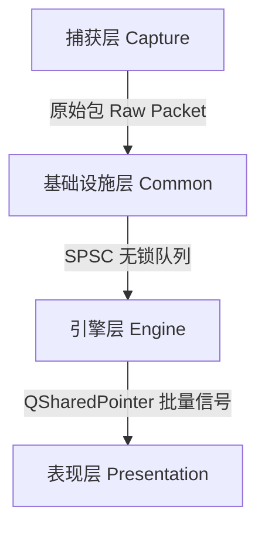

# Sentinel-Flow

## 项目简介

Sentinel-Flow 是一个基于 Linux 平台的万兆级网络流量分析与安全监测系统。项目采用 C++20 标准开发，利用 Qt6 构建图形用户界面，底层使用 Libpcap 进行数据包捕获。

该系统旨在提供实时的网络态势感知能力，主要功能包括深度协议解析、实时流量监控、基于 Aho-Corasick 自动机的入侵检测 (IDS) 以及高危报文的异步取证。

## 系统架构 (Hyper-Exchange v1.0)

项目遵循严格的分层设计与 MVC 架构，核心数据流向如下：



- **捕获层**: 封装 `libpcap`，负责从网卡获取二进制数据，并打上内核级纳秒时间戳。
- **基础设施层**: 提供无锁对象池 (`ObjectPool`)、单生产者单消费者无锁环形队列 (`SPSCQueue`)。
- **引擎层**: 包含核心绑定的多线程解析管线 (`PacketPipeline`) 和基于 AC 自动机的安全检测引擎 (`SecurityEngine`)。
- **表现层**: 基于 Qt6 MVC 架构的可视化界面，使用虚拟列表 (`TrafficTableModel`) 支撑海量数据无阻塞渲染。

## 核心技术点

1. **极致内存管理**: 基于无锁链表 (Lock-free List) 的对象池 (`ObjectPool`)，彻底规避热路径上的 `new/delete` 所带来的堆内存碎片和锁竞争。
2. **多核无锁管线**: 摒弃传统的互斥锁队列，采用 `SPSCQueue` + 线程 CPU 亲和性 (Core Affinity) 绑定，实现极低延迟的数据包吞吐。
3. **O(N) 多模式匹配**: 检测引擎内核集成 Aho-Corasick (AC) 自动机，支持 256 宽度的状态转移数组，流量检测耗时与规则数量完全解耦。
4. **MVC 高性能渲染**: UI 层摒弃低效的 `QTableWidget`，采用 `QAbstractTableModel` 底层对接 `std::deque` 缓冲池。即使面对 10万+ 报文，界面依然保持 60 FPS 的极致顺滑。

## 环境依赖

- **操作系统**: Fedora Linux 42/43 (或兼容的 Linux 发行版)
- **编译器**: GCC 15+ (支持 C++20)
- **构建工具**: CMake 3.20+
- **依赖库**:
  - Qt 6.x (Core, Gui, Widgets, Network, Charts)
  - libpcap-devel
  - sqlite-devel

## 构建与运行

### 1. 安装依赖 (Fedora 环境)

在终端中执行以下命令安装所有必需的开发库：

```Bash
sudo dnf update -y
sudo dnf install -y qt6-qtbase-devel qt6-qtcharts-devel libpcap-devel sqlite-devel cmake gcc-c++
```

### 2. 编译项目

进入项目根目录，创建 Release 构建目录并进行编译：

```Bash
mkdir cmake-build-release && cd cmake-build-release
cmake -DCMAKE_BUILD_TYPE=Release ..
make -j$(nproc)
```

### 3. 权限与运行策略

由于涉及网卡混杂模式抓包，程序需要底层网络嗅探权限。 **推荐方案**：使用 `setcap` 赋予二进制文件权限，这样可以直接以普通用户身份运行，体验最佳且最安全：

```bash
./cmake-build-debug/SentinelApp
```

⚠️ **关于 Sudo 运行时的黑屏问题 (Known Issue)**： 如果在 Wayland/X11 桌面环境下使用 `sudo` 或 `sudo -E` 强制提权运行 GUI 程序，将导致普通用户的 OpenGL 硬件渲染上下文丢失，引发**窗口内部完全黑屏**。 **解决方案**：v6.0 版本已在 `main.cpp` 入口处强制注入 `QCoreApplication::setAttribute(Qt::AA_UseSoftwareOpenGL);`，通过软件渲染降级完美规避了此环境隔离问题，无论以何种权限启动均可正常渲染。

## 最新架构演进 (v6.0 核心更新)

- **生命周期重构**: 修复了严重的 UI 挂载空指针问题，确立了 `页面实例化 -> setupUi -> AC树编译 -> 管线启动` 的严格时序屏障。
- **跨线程零拷贝**: 全局注册 `ParsedPacket` 与 `QSharedPointer` 元类型，通过批量信号投递彻底解决跨线程的深拷贝性能损耗。
- **AC 自动机内存加固**: 采用 `std::unique_ptr` 统一接管匹配节点，根绝内存泄漏与 UAF (Use-After-Free) 漏洞。
- **并发锁降级**: 黑名单与规则引擎全面采用 `std::shared_mutex` (读写锁)，极大提升读多写少场景的并发性能。
- **异步取证无阻塞**: 告警触发的 PCAP 存盘操作完全交由 `ForensicWorker` 后台异步执行，绝不占用网络解析时间片。

## 许可证

本项目暂仅供学术交流与毕业设计使用。