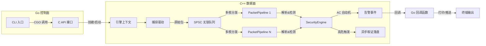

# Sentinel-Flow

## 项目简介

Sentinel-Flow 是一款基于 **C++ 核心引擎 + Go 控制面** 的轻量级网络入侵检测系统（NIDS），专注于高性能流量捕获与实时威胁检测。项目采用 C++20 实现底层数据面，利用无锁队列、对象池、eBPF/AF_XDP 零拷贝技术保障万兆线速处理能力；控制面则由 Go 语言 CLI 工具驱动，通过 CGO 调用 C API 实现动态规则下发与实时状态监控。

## 系统架构（Hyper-Exchange v2.0）



- **捕获层**：支持 libpcap（通用）与 eBPF/AF_XDP（高性能零拷贝）双后端，从网卡获取原始数据包并打上纳秒时间戳。
- **分发层**：基于五元组哈希将流量分发至多个 **SPSC 无锁环形队列**，每个队列绑定独立的 CPU 核心，消除缓存一致性开销。
- **引擎层**：多线程 `PacketPipeline` 并行处理，集成 **Aho-Corasick 自动机** 实现 O(N) 多模式威胁检测，支持动态规则热加载。
- **控制面**：Go 编译的 CLI 工具通过 CGO 绑定 C API，负责配置解析、规则下发、信号处理及回调事件输出。

## 核心特性

- **双模式捕获**：libpcap 通用抓包与 eBPF/XDP 零拷贝高性能捕获无缝切换。
- **动态规则引擎**：Go 侧实时添加/删除规则，触发底层 AC 自动机重编译，无需重启引擎。
- **无锁内存管理**：对象池（`ObjectPool`）与 SPSC 队列避免热路径上的内存分配与锁竞争。
- **实时威胁检测**：基于 AC 自动机的多模式匹配，支持数千条规则的同时扫描。
- **异步取证**：高危告警触发的 PCAP 存盘操作完全由后台线程处理，不阻塞检测管线。
- **实时统计**：每秒刷新吞吐量、丢包数等指标，通过 Go 回调输出。

## 环境依赖

- **操作系统**：Linux（推荐 Fedora 42/43、Ubuntu 24.04+）
- **编译器**：GCC 14+ 或 Clang 18+（支持 C++20）
- **构建工具**：CMake 3.20+
- **依赖库**：
  - libpcap-devel
  - sqlite-devel
  - libbpf-devel（可选，用于 eBPF 模式）
  - xdp-tools / libxdp（可选）

## 构建与运行

### 1. 安装依赖（Fedora）

```bash
sudo dnf update -y
sudo dnf install -y cmake gcc-c++ libpcap-devel sqlite-devel libbpf-devel
```

### 2. 编译 C++ 核心库

```bash
cd Sentinel-Flow
mkdir build && cd build
cmake -DCMAKE_BUILD_TYPE=Release ..
make -j$(nproc)
```

编译成功后将生成静态库 `build/libsentinel/libsentinel_core.a`。

### 3. 编译 Go CLI 工具

```bash
cd ..  # 回到项目根目录
go build -o sentinel-cli ./cmd/sentinel
```

### 4. 赋予网络权限并运行

```bash
# 授予抓包权限（无需 sudo）
sudo setcap cap_net_raw,cap_net_admin+eip ./sentinel-cli

# 启动引擎（默认捕获 lo 接口）
./sentinel-cli
```

若需使用 eBPF 模式，请确保已加载 XDP 程序并修改 `binding.go` 中的 `enable_ebpf` 字段。

## 命令行参数（计划支持）

当前版本为演示版，接口硬编码为 `lo`。后续将支持以下参数：

```bash
sentinel-cli -i eth0 -r ./rules -w 4 --ebpf
```

- `-i`：指定监听的网络接口
- `-r`：规则文件/目录路径
- `-w`：工作线程数
- `--ebpf`：启用 AF_XDP 零拷贝捕获

## 目录结构

```
.
├── cmd/sentinel/        # Go CLI 入口
├── pkg/engine/          # CGO 绑定层
├── libsentinel/         # C++ 核心引擎
│   ├── include/         # 对外 C API 头文件
│   └── src/             # 源码（捕获、解析、检测等）
├── cmake/               # CMake 模块
├── docs/                # 设计文档
├── tests/               # 单元测试
└── build/               # 构建产物
```

## 许可证

本项目采用 MIT License 开源许可。