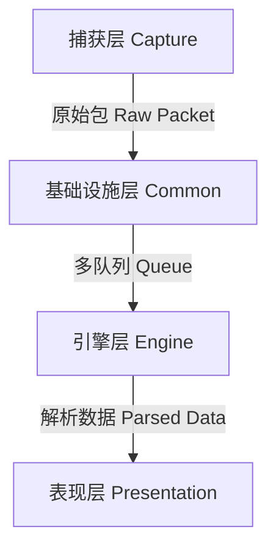

# Sentinel-Flow v6.0

## 项目简介
Sentinel-Flow 是一个基于 Linux 平台的网络流量分析与安全监测系统。项目采用 C++20 标准开发，利用 Qt6 构建图形用户界面，底层使用 Libpcap 进行数据包捕获。

该系统旨在提供实时的网络态势感知能力，主要功能包括协议解析、实时流量监控、基于规则的入侵检测 (IDS) 以及数据持久化存储。

## 系统架构
项目遵循分层设计原则，分为四层架构：


- **捕获层**: 封装 `libpcap`，负责从网卡获取原始二进制数据。
- **基础设施层**: 提供内存池 (`ObjectPool`)、线程安全队列 (`ThreadSafeQueue`) 和基础数据类型。
- **引擎层**: 包含多线程流水线、协议解析器 (`PacketParser`) 和安全检测引擎 (`SecurityEngine`)。
- **表现层**: 基于 Qt6 Widgets 的可视化界面，负责数据渲染和交互。

## 核心技术点

1. **内存管理优化**: 实现了一个基于无锁链表 (Lock-free List) 的对象池 (`ObjectPool`)，复用数据包内存块，避免了高频 `new/delete` 操作带来的堆内存碎片和锁竞争。
2. **零拷贝设计**: 在核心数据链路中，尽量传递内存块指针和整数类型 (IP/Port)，仅在 UI 显示阶段进行字符串格式化，降低 CPU 消耗。
3. **多线程流水线**: 采用生产者-消费者模型，捕获线程与解析线程分离，通过线程安全队列解耦。
4. **数据存储**: 使用 SQLite 的 WAL (Write-Ahead Logging) 模式进行告警日志的异步持久化。

## 环境依赖

- **操作系统**: Fedora Linux 42 (或兼容的 Linux 发行版)
- **编译器**: GCC 15+ (支持 C++20)
- **构建工具**: CMake 3.20+
- **依赖库**:
    - Qt 6.x (Core, Gui, Widgets, Network, Charts)
    - libpcap-devel
    - sqlite-devel
    - libatomic (部分架构需要)

## 构建与运行

### 1. 安装依赖 (Fedora)

```
sudo dnf install qt6-qtbase-devel qt6-qtcharts-devel libpcap-devel sqlite-devel cmake gcc-c++
```

### 2. 编译项目

```
mkdir cmake-build-release
cd cmake-build-release
cmake -DCMAKE_BUILD_TYPE=Release ..
make -j$(nproc)
```

### 3. 运行

由于涉及网卡混杂模式抓包，程序需要 Root 权限。

```
sudo ./SentinelApp
```

## 目录结构

- `src/capture`: 流量捕获实现
- `src/common`: 公共工具 (内存池, 队列, 类型定义)
- `src/engine`: 业务逻辑 (解析, 检测, 数据库)
- `src/presentation`: Qt 界面代码

## 许可证

本项目仅供学术交流与毕业设计使用。