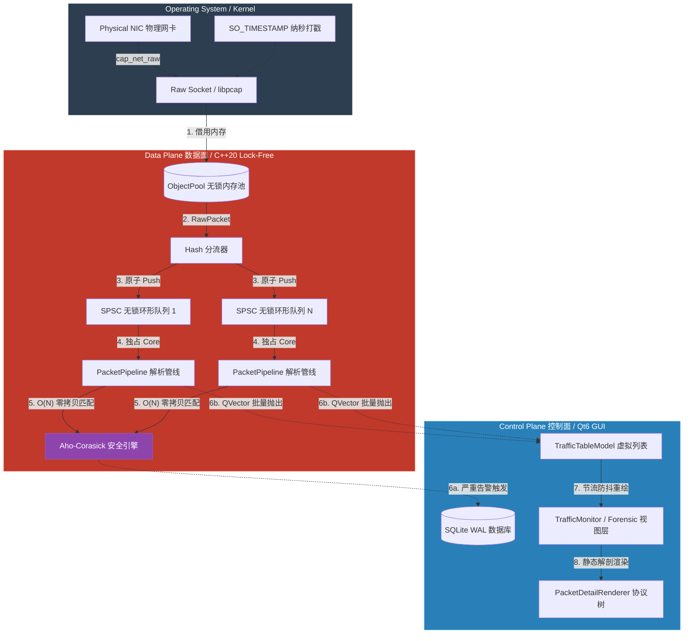

# 核心架构设计 (Architecture Design) - Sentinel-Flow v2.0

## 1. 架构愿景：Hyper-Exchange (超级交易所模型)

Sentinel-Flow v2.0 摒弃了传统的“抓包-处理-显示”流水线，引入了从高频交易 (HFT) 系统中汲取灵感的 **Hyper-Exchange** 架构。

**核心设计哲学：**

1. **零内存分配 (Zero-Allocation on Hot Path)**：在万兆流量洪峰下，任何一次热路径上的 `new/delete` 都会引发致命的系统调用开销与内存碎片。
2. **无锁化并发 (Lock-Free Concurrency)**：互斥锁 (`std::mutex`) 是高并发的毒药。本系统全面拥抱 C++20 `std::atomic`，通过内存顺序控制 (Memory Order) 实现无锁调度。
3. **读写分离与降频 (Read-Write Isolation)**：底层引擎以 10Gbps+ 的线速狂奔，而前端 UI 必须被严格保护，采用定时器批处理与虚拟列表技术防止重绘风暴 (Redraw Storm)。

---

## 2. 全局系统架构拓扑 (System Topology)

整个系统被严格划分为 **数据面 (Fast Path)** 和 **控制面 (Slow Path/UI)**。数据在两者之间的跨越，全部依赖智能指针与原子队列，实现物理内存的“零拷贝”。

------

## 3. 核心子系统剖析 (Core Subsystems)

### 3.1 极速内存池 (`ObjectPool`)

- **痛点**：传统的包解析往往伴随着大量的 `std::vector` 深拷贝，不仅耗时，极易触发 Linux OOM-Killer。
- **解法**：预先在堆上分配连续的 `MemoryBlock`。`PcapCapture` 捕获到报文后，直接向对象池借用内存块，并封装为带有自定义析构器 (`Deleter`) 的 `std::shared_ptr<MemoryBlock>`。数据包完成 UI 渲染或落盘后，引用计数归零，内存块自动无锁回归池中。

### 3.2 混合自旋 SPSC 无锁队列 (`SPSCQueue`)

- **痛点**：由于 Linux Futex 机制，传统多生产者多消费者 (MPMC) 锁队列在超高并发下会引发严重的线程上下文切换。
- **解法**：
  - 基于 C++11/20 原语构建单生产者-单消费者 (SPSC) 环形数组。
  - 使用 `std::memory_order_release` 和 `std::memory_order_acquire` 建立同步屏障 (Synchronization Barrier)。
  - 引入 **混合退避自旋 (Hybrid Spin Backoff)** 策略：先循环空转，再 `_mm_pause()`，最后再让出 CPU (`std::this_thread::yield`)。彻底消灭了互斥锁带来的毫秒级延迟。

### 3.3 Aho-Corasick 深度包检测引擎 (`SecurityEngine`)

- **痛点**：面对包含上万条 Snort 规则的恶意特征库，逐条遍历正则 (Regex) 会导致 CPU 瞬间满载，引发管线背压 (Backpressure) 和大规模丢包。
- **解法**：在内存中构建巨大的 AC 自动机状态机 (Trie + Failure Pointers)。无论规则库有 10 条还是 10 万条，对 Payload 的扫描复杂度恒定为 **O(N)**（N 为载荷长度），实现了真正的“规则数量免疫”。

### 3.4 隔离与降权启动模型 (`SentinelLauncher`)

- **痛点**：在 Linux 桌面上，GUI (Wayland/X11) 拒绝 Root 运行，但底层网卡必须具备特权。
- **解法**：通过 `socket(AF_PACKET)` 原生探针检测权限。拦截非特权进程，通过终端交互调起 `sudo setcap cap_net_raw,cap_net_admin=eip` 赋予二进制文件 Capabilities，随后调用 `execv` 携带原参数重载进程镜像，完美实现最小权限下的万兆吞吐。

### 3.5 MVC 与协议渲染解耦 (`PacketDetailRenderer`)

- **痛点**：庞大的协议层级解析 (L2-L7) 逻辑散落在各个 UI 类中，违背 DRY 原则，且极难维护。
- **解法**：彻底剥离视图与数据。引入 `PacketDetailRenderer` 静态工厂，将抽象的元数据瞬间展开为具备 Wireshark 级表现力的 `QTreeWidget` 协议树与 Hex/ASCII 并排转储视图。所有业务页面（实时监控、离线取证）只需一行代码即可实现专业级展示。