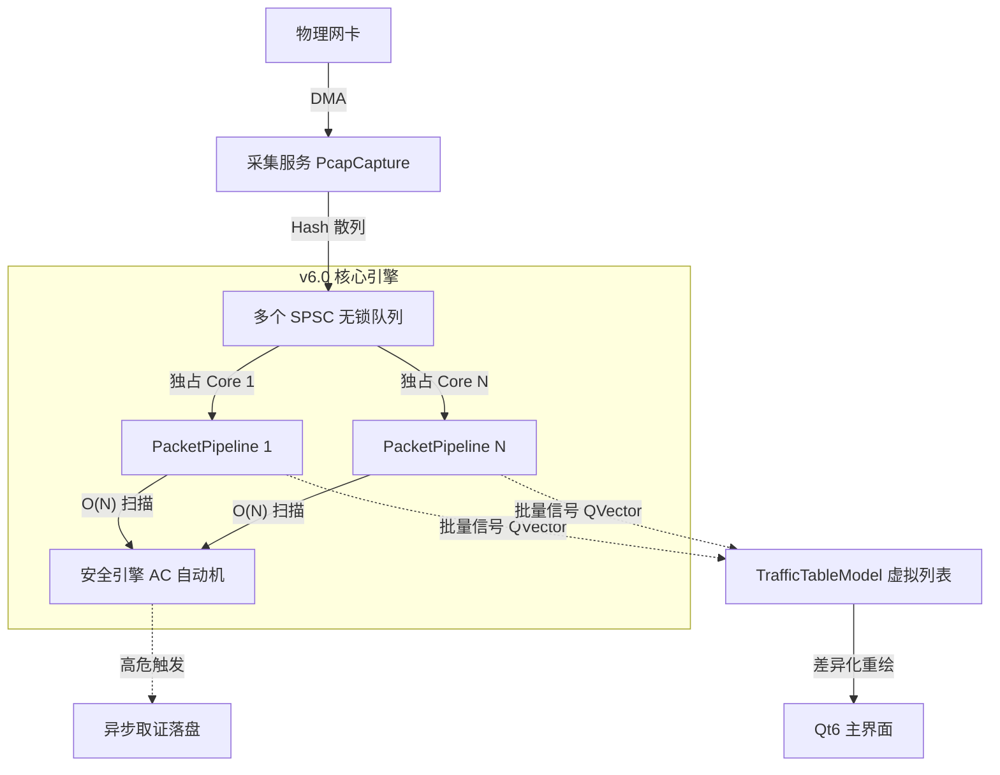

# Sentinel-Flow v1.0 架构设计文档

## 1. 概述 (Overview)
Sentinel-Flow v6.0 采用了 **"超级交易所 (Hyper-Exchange)" 架构**。该架构灵感来源于高频交易系统 (HFT) 和工业自动化控制系统。旨在以确定性的低延迟处理 10Gbps+ 线速流量，并彻底解决 UI 卡顿与多线程并发灾难。

## 2. 核心分层 (Core Layers)

### 第一层：采集与分流 (Capture & Dispatch)
- **职责**：原始流量的入口。
- **关键技术**：
  - **内核级打戳 (Kernel Timestamping)**：使用 `SO_TIMESTAMP` 获取纳秒级精度时间，不依赖用户态系统时间，保证取证的法律效力。
  - **核心亲和性分流 (Core-Affinity Dispatch)**：基于五元组 Hash 将流量精准散列到对应 CPU 物理核心的无锁队列中，消除缓存一致性开销 (Cache Bouncing)。
  - **零内存分配 (No-Allocation)**：使用预分配的 **无锁对象池 (Lock-free Object Pool)**，杜绝热路径上 `new/delete` 造成的内存碎片与系统调用阻塞。

### 第二层：分析引擎 (Analysis Engine)
- **职责**：分布式业务逻辑处理。
- **模型**：**SPSC (单生产者-单消费者) 无锁模型** 彻底取代早期的 MPMC。每个 Worker 独占一个环形队列与物理核心。
- **流水线级数**：
  - **L1 解码 (Decoder)**：协议头提取 (Ethernet/IP/TCP)。
  - **L2 重组 (Reassembly)**：TCP 流重组与会话状态跟踪。
  - **L3 质检 (Inspector)**：集成 Aho-Corasick (AC) 自动机的 O(N) 多模式威胁检测。
- **治理机制**：
  - **强一致性生命周期**：严格遵循 `compileRules() -> Worker 启动 -> 捕获开启` 的冷启动屏障，杜绝引擎空指针运行。
  - **智能背压 (Backpressure)**：当队列深度超过阈值时，主动丢弃低价值的大包，保全核心控制报文。

### 第三层：表现层 (Presentation)
- **职责**：数据可视化与用户交互。
- **设计模式**：严格的 MVC (Model-View-Controller) 架构。
  - **Models (底层数据模型)**：摒弃传统的 `QTableWidget`，采用基于 `QAbstractTableModel` 的虚拟列表，支持 10万+ 行数据的 $O(1)$ 级无阻塞渲染。
  - **跨线程批量投递 (Batch Signal Delivery)**：通过 Qt 元对象系统全局注册 (`qRegisterMetaType`) 的 `QSharedPointer<QVector<ParsedPacket>>`，实现后端高频事件（10k+ PPS）向低频视图快照的零拷贝转移。

## 3. 系统架构图

# 新增优化与架构加固 (Latest Updates)

## 新增与重构组件

### 多模式匹配内核 (Aho-Corasick Automaton)

- **位置**：`src/engine/flow/AhoCorasick.h`
- **职责**：替代低效的正则遍历，提供工业级 IDS 规则匹配。
- **加固**：重构了节点内存管理，采用 `std::unique_ptr` 和 `allNodes` 向量统一接管节点生命周期，彻底消灭了匹配过程中的段错误 (Segmentation Fault) 与内存泄漏漏洞。

### 视图网格模型 (TrafficTableModel)

- **位置**：`src/presentation/views/components/TrafficTableModel.h`
- **职责**：接管全量流量明细的渲染与内存分布。
- **设计**：底层依托 `std::deque` 缓冲池，结合 Qt 的 `beginInsertRows` 等局部更新机制，消除了高并发网络 I/O 对 GUI 主线程的冲击。

### 异步取证系统 (ForensicWorker)

- **位置**：`src/engine/workers/ForensicWorker.h`
- **职责**：将高危告警的 PCAP 存盘操作完全剥离出网络解析时间片。
- **设计**：后台守护线程处理文件 I/O，绝不阻塞网络管线。

## 关键性能与鲁棒性优化

- **Sudo 权限渲染隔离 (OpenGL Fallback)**：针对 Fedora/Wayland 下 root 权限启动导致的 GUI 显卡上下文丢失（纯黑屏）问题，在程序入口强制注入 `AA_UseSoftwareOpenGL` 进行软件渲染降级保护。
- **UI 挂载时序修正 (Lifecycle Alignment)**：纠正了组件实例化的“静默炸弹”，确立了必须在 `setupUi()` 前完成所有 Pages `new` 分配的铁律，防止侧边栏挂载空指针。
- **读写锁分离 (Shared Mutex)**：将 `SecurityEngine` 的黑名单与规则字典的并发控制从排他锁升级为 `std::shared_mutex`，在读多写少的流量检测场景下实现并发性能最大化。
- **无锁数据传递**：淘汰跨线程传参时的 `QVector` 深拷贝，全面切换为原子引用计数的 `QSharedPointer`。