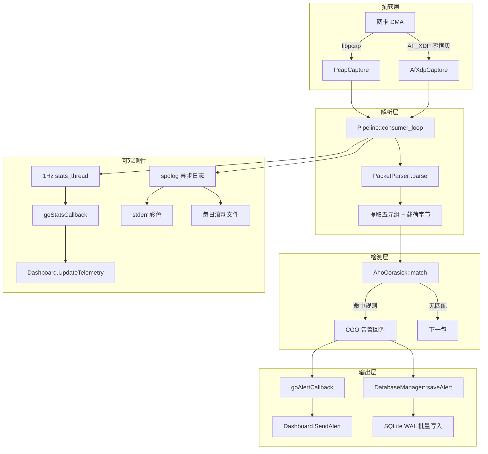

> **文档状态**: Active
> **最后更新**: 2026-06
> **所属子系统**: Core

# Sentinel-Flow 架构规格

## 1. 数据面管线



**关键路径**（每包必经）：

| 步骤 | 组件 | 操作 | 线程 |
|------|------|------|------|
| 1 | `ICapture`（Pcap 或 AfXdp） | 从网卡获取原始帧 → 构造 `RawPacket` | 捕获线程 |
| 2 | `PacketParser::parse()` | 解析以太网/IP/TCP/UDP 头部 → 完整五元组 `ParsedPacket` | Pipeline 线程 |
| 3 | `AhoCorasick::match()` | 载荷字节遍历 AC 全跃迁表 → 命中规则 ID 列表 | Pipeline 线程 |
| 4 | `goAlertCallback` | CGO 回调：`sentinel_alert_event_t` → Go 侧全部字段同步拷贝 → Dashboard | Pipeline 线程 |
| 5 | `DatabaseManager::saveAlert()` | 双缓冲前端入队 → 后台线程批量 `BEGIN IMMEDIATE` 写入 | DB 工作线程 |

**可观测性路径**（独立于检测热路径）：

| 步骤 | 组件 | 操作 | 线程 |
|------|------|------|------|
| 1 | `stats_thread`（1Hz） | 采样 Pcap/AfXdp/Pipeline/DB 遥测指标 → `sentinel_engine_stats_t` | C++ 统计线程 |
| 2 | `goStatsCallback` | CGO 回调 → Go 侧值拷贝 → Dashboard `atomic.Store` | 统计线程 |
| 3 | `spdlog` | 异步日志接收器（stderr 彩色 + 每日滚动文件），`overrun_oldest` 溢出策略 | 内部线程池 |

## 2. 线程模型

**主线程约束**：termui 通过 tcell 设置终端原始模式（raw mode）并安装 SIGWINCH 处理器。`ui.Init()` 与 `ui.PollEvents()` 必须在主 goroutine 执行，否则终端接管失效（白屏）。

| 线程 | 归属 | 职责 | 通信机制 |
|------|------|------|----------|
| **主 goroutine** | Go | termui 事件轮询 + 差异渲染循环（1s stats tick + 5s heartbeat） | `renderCh`（缓冲 1）接收告警推送；`dash.Quit()` 触发 `quit` 通道退出 |
| 捕获线程（Pcap） | C++ | `pcap_next_ex` 循环 → 构造 `RawPacket` → push Pipeline 输入队列 | SPSC 无锁队列（`Pipeline.cpp`） |
| 捕获线程（AfXdp） | C++ | AF_XDP Fill/RX Ring 轮询 → 零拷贝构造 `RawPacket` → push Pipeline 输入队列 | SPSC 无锁队列（`Pipeline.cpp`） |
| Pipeline 消费者线程 | C++ | popWait → PacketParser::parse → AhoCorasick::match → CGO 告警回调 → DB 双缓冲入队 | CGO 直接调用（同线程，~50-100ns）；双缓冲 + `condition_variable` → DB |
| DB 写入线程 | C++ | 双缓冲轮转 `flush()` → SQLite `BEGIN IMMEDIATE` 批量事务 | `alertQueue` |
| 统计线程（1Hz） | C++ | 周期采样 Pcap/AfXdp/Pipeline/DB 遥测指标 → CGO stats 回调 | CGO 直接调用（独立 `std::thread`） |
| 文件监控 goroutine | Go | fsnotify 监听 `configs/rules.yaml`，500ms 防抖 → `applyRules` | `sync.Mutex` 保护规则重载临界区 |
| 信号处理 goroutine | Go | `signal.Notify(SIGINT, SIGTERM)` → `dash.Quit()` | 通过 `quit` 通道通知主循环安全退出 |

**线程间通信路径**：

```
捕获线程 ──(SPSC 队列, Capacity=8192)──→ Pipeline 消费者线程 ──(CGO 回调)──→ Go Dashboard (原子变量 + renderCh)
                                              │
                            独立统计线程       │      └──(双缓冲队列)──→ DB 写入线程 ──(WAL)──→ SQLite
                         (1Hz, CGO stats 回调)─┘
```

**生命周期观测**：
- `Dashboard.Start()` 退出时自动关闭 `done` 通道
- 外部 goroutine 可通过 `dash.Done()` 阻塞等待 UI 关闭
- `main.go` 使用 `defer` 栈确保清理顺序：`watcher.Stop() → eng.Stop() → log.Close()`

## 3. C API 层

声明于 `libsentinel/include/sentinel/capi.h`（8 个导出函数 + 2 个回调类型）。完整规约见 [`cgo_boundary.md`](./cgo_boundary.md)。

```c
// 引擎生命周期
sentinel_engine_t sentinel_engine_create(void);
void sentinel_engine_destroy(sentinel_engine_t engine);
int  sentinel_engine_start(sentinel_engine_t engine, const char* device);
void sentinel_engine_stop(sentinel_engine_t engine);

// 规则管理
int  sentinel_engine_add_rule(sentinel_engine_t engine, const char* pattern, int rule_id);
void sentinel_engine_clear_rules(sentinel_engine_t engine);
int  sentinel_engine_build_matcher(sentinel_engine_t engine);
int  sentinel_engine_rule_count(sentinel_engine_t engine);

// 告警回调（五元组事件）
struct sentinel_alert_event_t;
typedef void (*sentinel_alert_callback_t)(const struct sentinel_alert_event_t* event,
                                          void* user_data);
void sentinel_engine_set_alert_callback(sentinel_engine_t engine,
                                        sentinel_alert_callback_t callback,
                                        void* user_data);

// 统计遥测回调（1Hz）
struct sentinel_engine_stats_t;
typedef void (*sentinel_stats_callback_t)(const struct sentinel_engine_stats_t* stats,
                                          void* user_data);
void sentinel_engine_set_stats_callback(sentinel_engine_t engine,
                                        sentinel_stats_callback_t callback,
                                        void* user_data);
```

**调用时序约束**：

```
create → add_rule × N → build_matcher → set_alert_callback → set_stats_callback → start
  → [运行中可调用 add_rule + build_matcher + clear_rules]
    → stop → destroy
```

**错误码语义**（`sentinel_engine_start` 返回值）：

| 返回值 | 含义 | 触发条件 |
|--------|------|----------|
| `0` | 成功 | 捕获驱动 + Pipeline 全部启动 |
| `-1` | 句柄无效 | `EngineContext*` 为 `nullptr` |
| `-2` | 捕获启动失败 | `ICapture::start()` 返回 false |

## 4. 核心数据结构

### 4.1 数据面核心类型

声明于 `libsentinel/include/sentinel/types/PacketTypes.h`、`libsentinel/include/sentinel/common/SPSCQueue.h`、`libsentinel/include/sentinel/common/memory/ObjectPool.h`：

```cpp
// 预分配内存块（对象池管理，无锁分配/回收）
struct MemoryBlock {
    uint8_t data[kMaxPacketSize];  // kMaxPacketSize = 2048
    uint32_t size = 0;
};

// 捕获层产出的原始报文（零拷贝 span + 共享所有权）
struct RawPacket {
    int64_t  kernel_timestamp_ns;
    BlockPtr block;                  // shared_ptr<MemoryBlock> 持有所有权
    uint32_t link_layer_offset;
    bool     truncated;
    std::span<const uint8_t> payload() const noexcept;
};

// SPSC 无锁环形队列（head/tail 各 alignas(64) 隔离缓存行）
// 默认 Capacity=8192（经 Benchmark 验证，完全驻留 L1D/L2 缓存）
template <typename T, size_t Capacity = 8192>
class SPSCQueue {
    std::array<T, Capacity> buffer_{};   // 编译期定长数组，无动态分配
    static constexpr size_t kMask = Capacity - 1;
    alignas(64) std::atomic<size_t> head_{0};
    alignas(64) std::atomic<size_t> tail_{0};
};

// Tagged Pointer 无锁对象池（CAS + 64-bit tag 防 ABA）
// 默认容量 8192（经 Benchmark 验证）
template <typename T>
class ObjectPool {
    static constexpr size_t kDefaultCapacity = 8192;
    struct TaggedHead { Slot* ptr; uint64_t tag; };
    alignas(64) std::atomic<TaggedHead> freeHead_;
};

// 解析后的结构化报文（完整五元组）
struct ParsedPacket {
    uint64_t id;
    int64_t  timestamp_ns;     // 内核纳秒时间戳
    uint32_t src_ip, dst_ip;   // 网络字节序
    uint16_t src_port, dst_port;
    uint8_t  ip_protocol;      // IANA IP 协议号
    std::string protocol;      // "TCP" / "UDP" / "ICMP"
    uint32_t payload_length;
    BlockPtr block;            // 持有数据所有权
};
```

### 4.2 AhoCorasick 自动机

声明于 `libsentinel/include/sentinel/engine/match/AhoCorasick.h`：

```cpp
class AhoCorasick {
    static constexpr int32_t kRoot = 0;
    static constexpr int32_t kAlphabetSize = 256;

    struct Node {
        std::array<int32_t, kAlphabetSize> next; // 全跃迁表（build 后完全填充）
        int32_t fail = -1;                        // 失败指针
        std::vector<int32_t> rule_ids;            // 匹配的规则 ID 列表
    };

    std::vector<Node> nodes_;     // 仅在构造/build 时分配（慢速路径）
    bool built_{false};

    // O(N) 匹配：单遍扫描 payload，每字节沿全跃迁表 O(1) 转移
    bool match(std::span<const uint8_t> payload, std::vector<int32_t>& out) const;
};
```

- `insert(pattern, rule_id)`: 逐字节插入 Trie 节点
- `build()`: BFS 构建失败指针 + 全跃迁表（256 × N 字节，一次性分配）
- `match()`: 单遍扫描，未构建时返回 false（守卫子句 `if (!built_) return false`）
- 热重载：`atomic<shared_ptr<Matcher>>::store(release)` 原子交换，读侧 `load(acquire)` 无锁

## 5. 无锁并发模型

详见 [`lockfree_model.md`](./lockfree_model.md)。

核心机制摘要：

| 组件 | 并发模式 | 容量 | 内存序策略 |
|------|----------|------|-----------|
| `SPSCQueue` | 单生产者 / 单消费者 | 8192（默认） | `acquire` / `release` |
| `ObjectPool` | 多生产者 / 多消费者（无锁栈） | 8192（默认） | CAS + Tagged Pointer（64-bit tag 防 ABA） |

**容量决策依据**（Phase 1.5 Benchmark）：
- 8192 条目队列（32 KiB `RawPacket`）完全驻留 L1D 缓存（32 KiB/核心）
- ObjectPool 容量对齐 SPSC 队列，减少池耗尽降级概率
- 大容量（65536）因跨缓存行未命中导致性能抖动，已废弃

**非热路径 mutex**（不在检测管线内）：

| 位置 | 保护对象 | 触发频率 |
|------|----------|----------|
| `DatabaseManager::queueMutex` | 双缓冲 alertQueue 轮转 | 每批告警一次 |
| `PcapCapture::handleMutex` | `pcap_t*` 句柄 | stop / setFilter（低频） |
| `ObjectPool::extraMutex` | 池耗尽时动态分配追踪 | 仅降级路径 |
| Go `Dashboard.mu` | alert 环形缓冲区 | 每条告警一次 |

## 6. 构建目标

| 目标 | 构建命令 | 产物 |
|------|---------|------|
| C++ 静态库 | `cmake -B build -DCMAKE_BUILD_TYPE=Release && cmake --build build --target sentinel_core -j$(nproc)` | `build/lib/libsentinel_core.a` |
| eBPF XDP 程序 | `cmake --build build --target bpf_prog` | `build/bpf/xdp_prog.o` + `xdp_prog.skel.h` |
| C++ 单元测试 | `cmake --build build --target sentinel_tests -j$(nproc)` | `build/tests/test_*` |
| C++ 基准测试 | `cmake --build build --target bench_object_pool bench_spsc_queue` | `build/tests/bench_*` |
| Go CLI | `go build -o bin/sentinel ./cmd/sentinel` | `bin/sentinel` |

## 7. CLI 参数

实现于 `cmd/sentinel/main.go`（`flag` 标准库）：

```
sentinel -i <iface> -r <rules.yaml>

  -r  string  YAML 规则配置文件路径 (默认: configs/rules.yaml)
  -i  string  网络接口名称 (默认: lo)
```

## 8. 规则配置格式

`configs/rules.yaml`:

```yaml
rules:
  - id: 1001
    enabled: true
    protocol: "ANY"
    pattern: "attack_pattern"
    level: 4
    description: "检测到攻击载荷"
```

Go 侧通过 `fsnotify` 监听文件变更，500ms 防抖后调用 `applyRules()` → `clear_rules` → `add_rule × N` → `build_matcher`，触发 AC 自动机原子热重载。

## 9. 可观测性架构

### 9.1 spdlog 异步遥测日志

集成于 `libsentinel/src/common/utils/Logger.{h,cpp}`：

- **异步接收器**：stderr 彩色输出（终端实时查看） + 每日滚动文件（`logs/sentinel_<date>.log`）
- **溢出策略**：`overrun_oldest` — 日志队列满时丢弃旧条目，保证数据面不阻塞
- **日志宏**：`SENTINEL_TRACE/DEBUG/INFO/WARN/ERROR/CRITICAL`，全局替换 `std::cerr`/`std::cout`
- **编译配置**：Release 模式下 TRACE 级别编译期关闭

### 9.2 遥测数据通道

- C++ 统计线程（1Hz）采样全部组件指标 → `sentinel_engine_stats_t` → `goStatsCallback`
- Go Dashboard 原子存储遥测快照 → Controller 差异渲染
- `has_fatal_error` 标志由 Pipeline `consumer_loop` 异常处理置位，stats 回调传播，Go 侧触发安全关机

## 10. 扩展预留

| 接口 | 头文件 | 状态 |
|------|--------|------|
| `ICapture` | `capture/ICapture.h` | PcapCapture ✅ / AfXdpCapture ✅（框架已就绪） |
| `AhoCorasick` | `engine/match/AhoCorasick.h` | ✅ 已实现（全跃迁表 + 原子热重载） |
| `capi.h` | `include/sentinel/capi.h` | ✅ 已扩展（告警五元组 + stats 遥测 + stats 回调） |
| `AfXdpCapture` | `capture/AfXdpCapture.h` | ✅ UMEM 映射与生命周期完成，捕获循环桩待填充 |
| `xdp_prog.c` | `bpf/xdp_prog.c` | ✅ XDP 内核程序（Ethernet/IPv4/TCP/UDP 解析 + xsks_map 重定向） |

**未来扩展方向**：
- 新增 `DPDKCapture` / `NetmapCapture` 后端（实现 `ICapture` 接口）
- 替换匹配引擎为 Hyperscan（实现相同 `match` 语义接口）
- 新增 `sentinel_engine_get_last_error()` 细粒度错误传播
- RCU（Read-Copy-Update）规则热重载消除瞬时盲区
