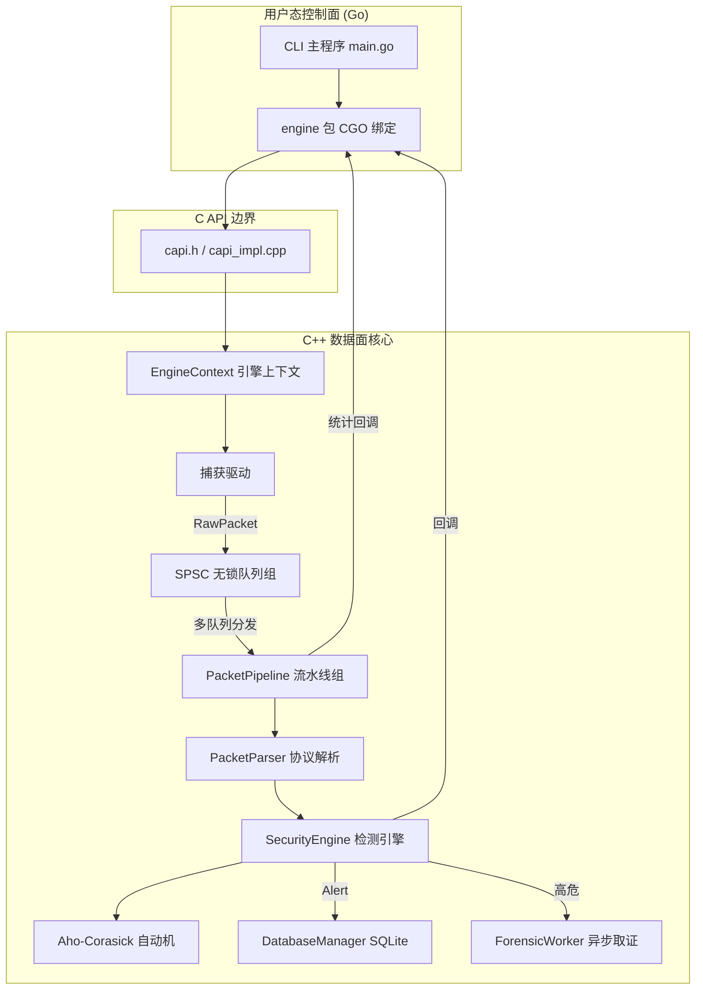
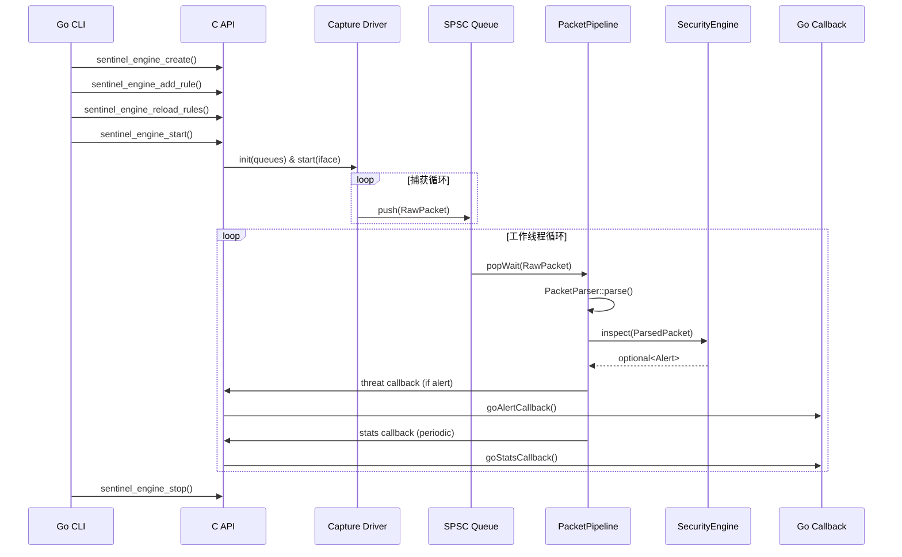

# Sentinel-Flow 架构设计

## 1. 概述

Sentinel-Flow 采用 **C++ 高性能数据面 + Go 轻量控制面** 的分离式架构。数据面负责实时流量捕获、协议解析、威胁检测与证据留存，以 C++20 编写并编译为静态库；控制面由 Go 语言 CLI 工具实现，通过 CGO 绑定调用 C API，完成配置管理、规则下发及监控反馈。该设计兼顾了高性能底层处理与上层快速迭代的灵活性。

## 2. 整体架构图



### 数据流（捕获 → 告警）

```
NIC → [PcapCapture/EBPFCapture] → SPSC Queue → PacketPipeline (每核心)
                                                        ↓
                                            PacketParser (L3/L4)
                                                        ↓
                                          SecurityEngine (Aho-Corasick)
                                                        ↓
                                            C API 回调 → Go 告警输出
```

## 3. 分层详解

### 3.1 控制面（Go 层）

**位置**：`cmd/sentinel/`、`pkg/engine/`

**职责**：

- 解析命令行参数（接口、规则路径、线程数等）
- 通过 CGO 调用 `sentinel_engine_create` 初始化引擎上下文
- 动态构建规则结构体，调用 `sentinel_engine_add_rule` 和 `sentinel_engine_reload_rules` 下发规则
- 注册 Go 回调函数（`goAlertCallback`、`goStatsCallback`），接收来自 C++ 的告警与统计事件
- 驱动终端仪表盘（`Dashboard`），提供实时统计、吞吐量显示和颜色编码告警
- 监听系统信号，优雅停止引擎并释放资源

**关键交互**：

```go
handle := C.sentinel_engine_create(&conf)
C.sentinel_engine_set_callbacks(handle, alertCb, statsCb, nil)
C.sentinel_engine_load_rules(handle, &rules[0], C.int(len(rules)))  // 原子批量下发
C.sentinel_engine_start(handle)
```

### 3.2 C API 边界

**位置**：`libsentinel/include/sentinel/capi.h`、`libsentinel/src/capi_impl.cpp`

**职责**：

- 定义纯 C 接口，供 CGO 直接调用
- 封装 C++ 对象与智能指针，对外暴露不透明句柄 `SentinelEngineHandle`
- 管理 `EngineContext` 生命周期，持有捕获驱动、工作队列和流水线实例
- 将 Go 回调函数指针转换为 C++ 可调用的 `std::function`，并在检测线程中安全调用

**核心数据结构**：

```cpp
struct EngineContext {
    SentinelConfig config = {};
    std::string persistent_iface;
    std::string persistent_rules;
    std::string persistent_offline_pcap;
    OnAlertCallback alert_cb = nullptr;
    OnStatsCallback stats_cb = nullptr;
    void* user_data = nullptr;

    sentinel::capture::ICaptureDriver* capture_driver = nullptr;
    std::vector<std::unique_ptr<sentinel::engine::PacketPipeline>> pipelines;
    std::vector<std::unique_ptr<PacketQueue>> worker_queues;
};
```

### 3.3 捕获驱动层

**位置**：`libsentinel/src/capture/`

**职责**：

- 从网卡获取原始数据帧，支持两种后端：
  - **PcapCapture**：基于 libpcap，兼容性好，适用于通用场景。
  - **EBPFCapture**：基于 AF_XDP 零拷贝技术，性能极高，适用于万兆网络。
- 将原始包封装为 `RawPacket` 结构，通过轮询方式推入多个 `SPSCQueue`，实现多核负载分发。
- 驱动实现均为单例模式，全局仅一个实例运行。

**接口抽象**：

```cpp
class ICaptureDriver {
    virtual void init(const std::vector<PacketQueue*>& queues) = 0;
    virtual void start(const std::string& device) = 0;
    virtual void stop() = 0;
};
```

### 3.4 分发与队列层

**位置**：`libsentinel/src/common/queues/SPSCQueue.h`

**职责**：

- 提供单生产者单消费者（SPSC）无锁环形队列，作为捕获线程与工作线程之间的高速通道。
- 使用 `alignas(64)` 缓存行对齐避免伪共享。
- 支持带超时的阻塞等待 `popWait`，使工作线程在没有数据时高效休眠。

### 3.5 流水线处理层（PacketPipeline）

**位置**：`libsentinel/src/engine/pipeline/`

**职责**：

- 每个工作线程独占一个 `PacketPipeline` 实例和对应的输入队列。
- 循环从队列取出 `RawPacket`，调用 `PacketParser::parse()` 进行协议解析。
- 将解析后的 `ParsedPacket` 传递给 `IInspector`（即 `SecurityEngine`）进行威胁检测。
- 支持 CPU 亲和性绑定（核心 0 留给捕获线程，工作线程从核心 1 开始逐个绑定），减少线程迁移开销。
- 定期（150ms）刷新统计指标并更新规则快照，通过 Go 回调输出到控制台。

**核心运行循环**：

```cpp
while (running) {
    auto raw = inputQueue->popWait(100ms);
    auto parsed = PacketParser::parse(raw);
    if (auto alert = inspector->inspectFast(parsed, stateSnapshot)) {
        db.saveAlert(alert);
        if (alert.level >= High) forensicWorker.enqueue(parsed);  // 高危取证
        threatCallback(alert, parsed);
    }
    parsed.block.reset();  // 归还对象池
    if (elapsed > 150ms) flushStats();  // 定期统计刷新
}
```

### 3.6 检测引擎（SecurityEngine）

**位置**：`libsentinel/src/engine/flow/SecurityEngine.h`

**职责**：

- 实现 `IInspector` 接口，提供核心检测能力。
- 内部集成 **Aho-Corasick 自动机**，支持多模式字符串匹配，时间复杂度 O(N) 且与规则数量无关。
- 规则通过 `addRule()` 动态添加，由 `compileRules()` 触发自动机构建。
- 维护 IP 黑名单（支持动态增删）和告警抑制缓存，避免重复报警。
- 检测到威胁后生成 `Alert` 结构，并调用 `DatabaseManager` 持久化，同时触发取证工作线程。

**规则管理线程安全**：采用 `atomic<shared_ptr<EngineState>>` 快照模式——写线程构建新快照后原子替换，读线程通过 `getSnapshot()` 获取不可变快照，实现无锁并发读取。

### 3.7 存储与取证

**位置**：`libsentinel/src/engine/context/DatabaseManager.cpp`、`libsentinel/src/engine/workers/ForensicWorker.h`

**职责**：

- `DatabaseManager`：封装 SQLite3 操作，启用 WAL 模式提升并发写入能力，所有数据库访问均加锁保护。
- `ForensicWorker`：独立后台线程，负责将高危告警对应的原始数据包写入 PCAP 文件，避免阻塞检测路径。

## 4. 数据流时序



## 5. 线程模型

- **捕获线程** — 从网卡读取，入队到 SPSC 环形缓冲区。
- **工作线程** — 每核心一个 `PacketPipeline`（通过 pthread 亲和性固定），各自消费各自的 SPSC。
- **取证线程** — 为高危告警提供异步 pcap 写入。
- **数据库线程** — SQLite WAL 写入（通过 `DatabaseManager` 单写入者）。
- 所有线程间通信均为**无锁**（SPSC 环形缓冲区、atomic shared_ptr 状态交换）。

## 6. 性能关键设计

- **无锁化**：捕获到检测全链路无互斥锁，仅使用原子操作和内存序保证可见性。
- **零拷贝**：`RawPacket` 使用对象池分配，`ParsedPacket` 通过 `shared_ptr` 批量传递，避免重复拷贝。
- **多核并行**：每个 CPU 核心运行独立的流水线，队列数与线程数一致，数据通过五元组哈希均匀分发。
- **批量处理**：工作线程以时间或数量为阈值批量提交结果，减少回调与 I/O 频率。
- **eBPF 卸载**：XDP 程序可在网卡驱动层直接过滤或转发数据包，进一步降低 CPU 负载。

## 7. 扩展点

- **新增捕获后端**：实现 `ICaptureDriver` 接口即可（如 DPDK、netmap）。
- **新增检测算法**：实现 `IInspector` 接口，并注入到 `PacketPipeline` 中。
- **新增回调类型**：在 `capi.h` 中扩展回调函数指针，并在 `capi_impl.cpp` 中调用。

## 8. 待优化项

- 当前 eBPF 探针未纳入 CMake 构建，需手动编译 `xdp_prog.c`。
- CLI 参数硬编码，需引入 `flag` 包增强灵活性。
- 规则 ID 解析依赖字符串截取，应改为直接传递整型字段。

---

## 9. 项目演进路线图

### 当前状态

Sentinel-Flow 已完成从 Qt GUI 到 **Go CLI + C++ 核心库** 的架构转型。数据面基于无锁队列、对象池和 AC 自动机实现高性能流量检测，控制面由 Go 提供动态规则下发与实时监控。

### 未来规划

#### Phase 1: 协议深度解析 (DPI)

- [ ] 从 L4 扩展至 L7 应用层协议识别与字段提取（HTTP、DNS、TLS、SMTP 等）。
- [ ] 支持基于协议字段的精细化规则匹配（如 HTTP URI、User-Agent、DNS 查询域名）。
- [ ] 实现协议解析器的插件化架构，便于动态加载自定义解析器。

#### Phase 2: eBPF 捕获增强

- [ ] 将 `xdp_prog.c` 的编译集成至 CMake 构建流程。
- [ ] 实现 eBPF/XDP 程序的动态加载与卸载，无需重启进程即可切换捕获后端。
- [ ] 支持通过 BPF map 动态更新内核态过滤规则（如 IP 黑名单），减少用户态拷贝。
- [ ] 提供 eBPF 性能监控指标（丢包率、XDP 程序执行时间）。

#### Phase 3: 规则热加载与智能管理

- [x] 支持监听规则文件（YAML）变化，自动触发 AC 自动机重编译。
- [x] 原子批量规则加载 API（`sentinel_engine_load_rules`），避免逐条下发竞态。
- [ ] 增加规则优先级与预过滤机制，降低误报率。
- [ ] 提供 Go 侧规则验证 API，防止无效规则导致引擎异常。

#### Phase 4: 集群化与远程监控

- [ ] 设计 gRPC API，支持远程下发规则、拉取统计信息与告警事件。
- [ ] 实现多节点集中管理控制平面（Sentinel Controller）。
- [ ] 支持将告警与流量元数据导出至 Kafka / Elasticsearch。

#### Phase 5: 跨平台与可移植性

- [ ] 抽象操作系统相关接口，初步支持 macOS（使用 `/dev/bpf`）和 Windows（使用 Npcap）。
- [ ] 提供 Docker 镜像，简化部署与测试。

### 已完成里程碑（v2.0 架构）

- ✅ C++ 核心引擎编译为静态库，Go 通过 CGO 调用。
- ✅ 动态规则添加与 AC 自动机热重载（返回所有匹配模式）。
- ✅ 双捕获后端：libpcap 与 AF_XDP（基础实现，待实机验证）。
- ✅ 多核流水线并行，CPU 亲和性绑定（核心 0 留给捕获，工作线程从核心 1 开始）。
- ✅ 异步取证：高危告警触发原始报文 PCAP 落盘。
- ✅ SQLite WAL 模式批量告警写入。
- ✅ YAML 规则配置文件解析 + 文件监听热重载。
- ✅ 终端实时统计与告警输出。
- ✅ 原子批量规则加载 API（消除逐条下发竞态）。
- ✅ 告警抑制缓存（2 秒窗口内同规则+同源 IP 去重）。
- ✅ 无锁对象池（ObjectPool）+ SPSC 环形队列。
