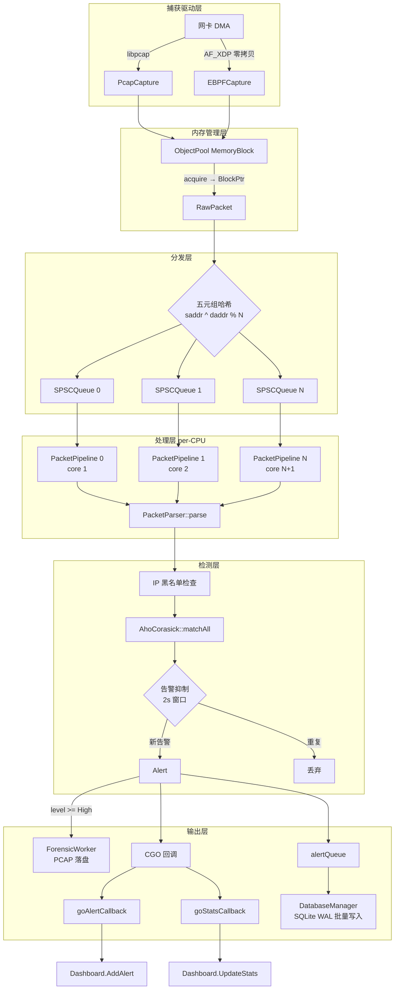

# Sentinel-Flow 架构规格

## 1. 数据面管线



**关键路径**（每包必经）：

| 步骤 | 组件 | 操作 | 内存序 |
|------|------|------|--------|
| 1 | `PcapCapture` / `EBPFCapture` | 从网卡获取原始帧 → `PacketPool::acquire()` → 填充 `MemoryBlock` | N/A |
| 2 | `ObjectPool<MemoryBlock>` | Tagged Pointer CAS 无锁分配 | `acq_rel` |
| 3 | `SPSCQueue<RawPacket>` | `push()` 入队（五元组哈希选择目标队列） | `release` |
| 4 | `PacketPipeline` | `popWait(100ms)` → `PacketParser::parse()` → `ParsedPacket` | `acquire` |
| 5 | `SecurityEngine` | `inspectFast()` → `AhoCorasick::matchAll()` → 告警抑制 | `acquire`（读快照） |
| 6 | CGO 回调 | Pipeline 线程直调 Go 函数指针 | 同线程，无切换 |
| 7 | `DatabaseManager` | `saveAlert()` → `alertQueue` → `workerLoop` 批量 `BEGIN IMMEDIATE` | mutex（I/O 线程） |

## 2. 线程模型

| 线程 | 绑定 | 职责 | 数据输入 | 数据输出 |
|------|------|------|----------|----------|
| 捕获线程 | 核心 0 | `pcap_next_ex` / AF_XDP poll → push SPSCQueue | 网卡 DMA | SPSCQueue |
| Pipeline 线程 × N | 核心 1..N | popWait → parse → inspect → callback | SPSCQueue | CGO 回调 + DB 队列 |
| DB 写入线程 | 不绑定 | 批量 SQLite 事务 | alertQueue | SQLite WAL |
| 取证线程 | 不绑定 | Pcap 文件批量写入 | ForensicWorker buffer | PCAP 文件 |
| Go main goroutine | — | CLI + 信号处理 + 规则文件监听 | OS signal / fsnotify | C API |
| Go Dashboard goroutine | — | 每秒 ANSI 终端渲染 | 全局原子变量 | 终端 stdout |

**线程间通信**：
- 捕获 → Pipeline: SPSC 无锁队列
- Pipeline → Go callback: CGO 直接调用 (同线程)
- Pipeline → DB: `queueMutex` + `condition_variable`
- Pipeline → Forensic: `bufferMutex_` + `condition_variable`
- Go dashboard ← C++ stats: `atomic<Uint64>` (relaxed)

## 3. 核心数据结构

### 3.1 C API 层

声明于 `libsentinel/include/sentinel/capi.h`。完整规约见 [`cgo_boundary.md`](./cgo_boundary.md)。

```c
typedef struct SentinelConfig {        // 引擎配置
    const char* interface_name;
    uint32_t num_worker_threads;
    uint32_t ring_buffer_size;
    uint8_t enable_ebpf;
    const char* rules_path;
    const char* offline_pcap_path;
    uint8_t verbose;
} SentinelConfig;

typedef struct SentinelRule {          // 检测规则
    int32_t id;
    uint8_t enabled;
    const char* protocol;              // "TCP"/"UDP"/"ICMP"/"ANY"
    const char* pattern;               // AC 自动机匹配的字节序列
    int32_t level;                     // 0=Info, 1=Low, 2=Medium, 3=High, 4=Critical
    const char* description;
} SentinelRule;

typedef struct AlertEvent {            // 告警事件（C → Go 回调）
    uint64_t timestamp_ns;
    uint32_t src_ip; uint32_t dst_ip;
    uint16_t src_port; uint16_t dst_port;
    uint8_t  protocol;
    int32_t  rule_id;
    const char* payload_snippet;       // 回调返回即失效
} AlertEvent;
```

### 3.2 数据面核心类型

声明于 `libsentinel/src/common/types/NetworkTypes.h`:

```cpp
struct MemoryBlock {                   // 预分配对象，MAX_PACKET_SIZE=2048
    uint8_t data[2048];
    uint32_t size = 0;
};

struct RawPacket {                     // 捕获后的原始报文
    int64_t kernelTimestampNs;
    BlockPtr block;                    // shared_ptr<MemoryBlock>
    uint32_t linkLayerOffset = 14;
    bool isTruncated = false;
};

struct ParsedPacket {                  // 解析后的结构化报文
    uint64_t id; int64_t timestamp;
    uint32_t srcIp, dstIp; uint16_t srcPort, dstPort;
    char protocol[16];
    uint32_t length, totalLen;
    std::vector<uint8_t> payloadData; size_t payloadSize;
    BlockPtr block;                    // 与 RawPacket 共享所有权
};

struct Alert {                         // 检测告警
    enum Level { Info, Low, Medium, High, Critical };
    uint64_t timestamp; Level level;
    uint32_t sourceIp; int32_t ruleId;
    std::string description, ruleName;
};
```

### 3.3 引擎状态快照

```cpp
struct EngineState {
    std::unordered_map<int, IdsRule> rulesMap;
    std::vector<IdsRule> rules;
    std::shared_ptr<AhoCorasick> acDetector;
};
// 写路径: compileRules() → store(release)
// 读路径: getSnapshot() → load(acquire) → inspectFast(snapshot)
```

## 4. 无锁并发模型

完整分析见 [`lockfree_model.md`](./lockfree_model.md)。

核心机制：
- **SPSCQueue**: `head`/`tail` 各 `alignas(64)` 隔离缓存行，`acquire`/`release` 内存序保证单生产者单消费者正确性
- **ObjectPool**: Tagged Pointer (ptr + 64-bit tag) CAS 循环防止 ABA 问题
- **EngineState**: `atomic<shared_ptr<>>` 实现单写者多读者快照——写路径在锁外构建新快照后原子交换
- **GlobalStats**: `fetch_add(relaxed)` — 计数器间无因果依赖，仅需原子增量

## 5. 构建目标

| 目标 | 构建命令 | 产物 |
|------|---------|------|
| C++ 静态库 | `cmake -B build && cmake --build build` | `build/libsentinel/libsentinel_core.a` |
| C++ 单元测试 | `cmake --build build --target sentinel_tests` | `build/tests/sentinel_tests` |
| eBPF 探针 | `cmake -DBUILD_EBPF=ON` (默认 ON) | `build/libsentinel/xdp_prog.o` |
| Go CLI | `go build -o sentinel-cli ./cmd/sentinel` | `sentinel-cli` |

## 6. CLI 参数

实现于 `cmd/sentinel/main.go:19-27` (`flag` 标准库):

```
sentinel-cli -i <iface> -r <rules.yaml> -w <workers> [--ebpf] [--offline <pcap>] [-v] [-h]

  -i        string   网络接口名称 (默认: lo)
  -r        string   YAML 规则文件路径 (默认: ./configs/rules.yaml)
  -w        int      工作线程数 1-64 (默认: 4)
  --ebpf    bool     启用 AF_XDP 零拷贝捕获 (默认: false)
  --offline string   离线 PCAP 文件路径 (默认: "" = 在线模式)
  -v        bool     启用详细日志 (默认: false)
  -h        bool     显示帮助
```

## 7. 规则配置格式

`configs/rules.yaml`:

```yaml
rules:
  - id: 1001
    enabled: true
    protocol: "ANY"
    pattern: "sentinel_test_attack"
    level: 4
    description: "Simulated Attack: sentinel_test_attack payload detected"
```

Go 侧通过 `fsnotify` 监听文件变更，500ms 防抖后调用 `LoadRules()` 触发 AC 自动机重建。

## 8. 扩展点

| 接口 | 头文件 | 扩展方式 |
|------|--------|---------|
| `ICaptureDriver` | `capture/interface/ICaptureDriver.h` | 实现新捕获后端（DPDK, netmap） |
| `IInspector` | `engine/interface/IInspector.h` | 实现新检测算法（正则、ML 模型） |
| `C API` | `include/sentinel/capi.h` | 添加新回调类型或引擎操作 |
