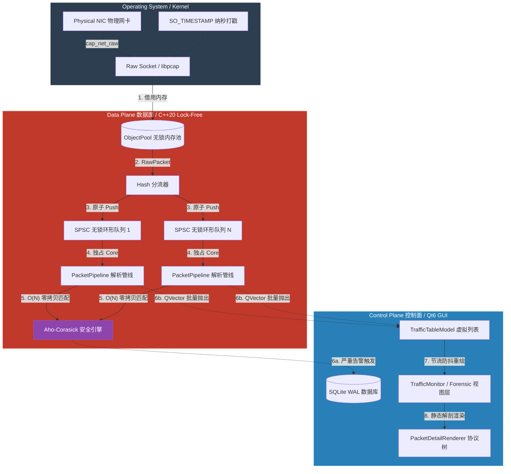

# 核心架构设计

## 架构设计原则

Sentinel-Flow 的数据流基于数据面 (Data Plane) 与控制面 (Control Plane) 分离的原则设计，以支持高吞吐环境下的流量检测与可视化。

**核心考量与约束：**

1. **热路径零分配 (Zero-Allocation on Hot Path)**：在数据包捕获与解析的核心循环中，禁止直接调用 `new/delete`。系统采用预分配的无锁内存池 (`ObjectPool`) 托管内存块，以消除运行时的内存分配开销和碎片化问题。
2. **无锁并发模型 (Lock-Free Concurrency)**：跨线程的数据传递弃用 `std::mutex`。采用基于 C++20 `std::atomic` 的 SPSC (单生产者单消费者) 队列，结合明确的内存序 (`std::memory_order`) 建立同步屏障。
3. **读写隔离与事件批处理 (Read-Write Isolation)**：将高频的网络报文处理与低频的 UI 渲染严格隔离。后端解析引擎将结果装载为 `QVector` 进行批量投递，UI 线程作为慢速消费者按批次消费数据，配合 Qt 虚拟列表规避界面的重绘阻塞。

## 全局系统拓扑

系统数据流被划分为**数据面 (Data Plane)** 与**控制面 (Control Plane)**。跨边界的数据传递均通过智能指针托管物理内存，确保载荷在生命周期内的零拷贝流转。

------

## 核心组件交互与实现机制

### 1. PcapCapture：流量捕获与背压控制
- **机制**：通过 `pcap_next_ex` 获取报文，并通过 `header->ts` 提取内核级纳秒时间戳。
- **哈希分流**：根据报文的源 IP 与目的 IP 异或运算 (`saddr ^ daddr % queueCount`) 实现软 RSS 分流，确保同一 TCP 会话的报文被派发到相同的解析管线。
- **防拥塞截断 (Backpressure)**：当目标 Worker 队列积压超过 5000 帧时，触发防御机制。捕获引擎停止借用完整内存，转而将报文硬截断为定长（仅保留 L2-L4 头部，丢弃应用层载荷），确保在极端洪峰下不丢失连接元数据。

### 2. PacketPipeline：核绑定与批处理
- **机制**：消费者线程启动时调用 `pthread_setaffinity_np` 绑定至特定物理 CPU 核心，以维持 L1/L2 缓存的局部性。
- **UI 防抖批处理**：为避免逐包触发 Qt 信号导致 GUI 线程拥塞，管线内部维护了一个 `QVector<ParsedPacket>`。只有当累积达到 5000 个报文或定时器超过 150ms 时，才会将这批数据打包并交由 `QSharedPointer` 跨线程投递给模型层。

### 3. Aho-Corasick 引擎：多模式检测
- **机制**：抛弃逐条正则匹配，在引擎初始化时预构建 AC 自动机状态机 (Trie 树及 Fail 指针)。
- **特征**：不论内存中装载了多少条威胁特征规则，匹配的时间复杂度被严格限制在 $O(N)$，其中 $N$ 为该报文的载荷字节数，避免了由于规则库膨胀导致的 CPU 满载丢包。

### 4. SentinelLauncher：动态权限下放
- **机制**：通过探针调用 `socket(AF_PACKET)` 检查当前进程是否具备底层网络捕获权限。
- **热重载**：若权限不足，程序通过 `fork` 衍生子进程执行 `setcap cap_net_raw,cap_net_admin=eip`，修改可执行文件自身权限，随后使用 `execv` 携带原始启动参数 (如 `--gui` / `--cli`) 重载进程，避免以 root 直接运行带来的显示服务（Wayland/X11）拒绝连接问题。

### 5. PacketDetailRenderer：启发式协议渲染
- **机制**：提供独立的静态函数将数据包模型（MVC）投射为 `QTreeWidget` 视图。
- **L7 载荷分析**：渲染引擎会统计载荷中的可打印 ASCII 字符比例。若比例超过 35%，则将其判定为文本协议（如 HTTP / SSDP）并按行展开渲染；否则，判定为二进制协议并输出标准 Wireshark 风格的 Hex 十六进制转储。
