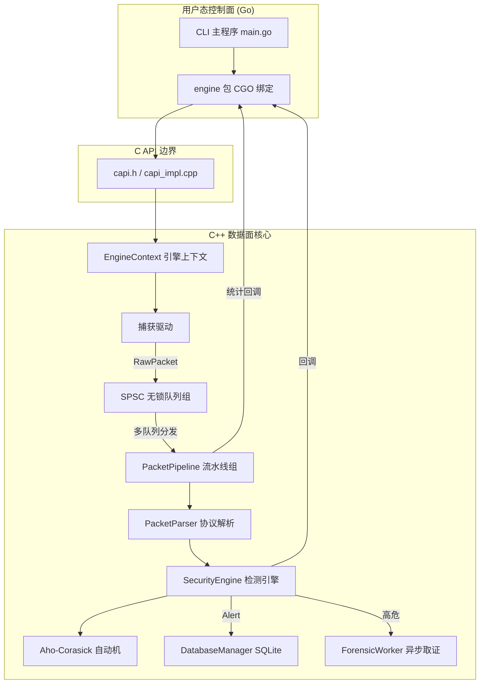
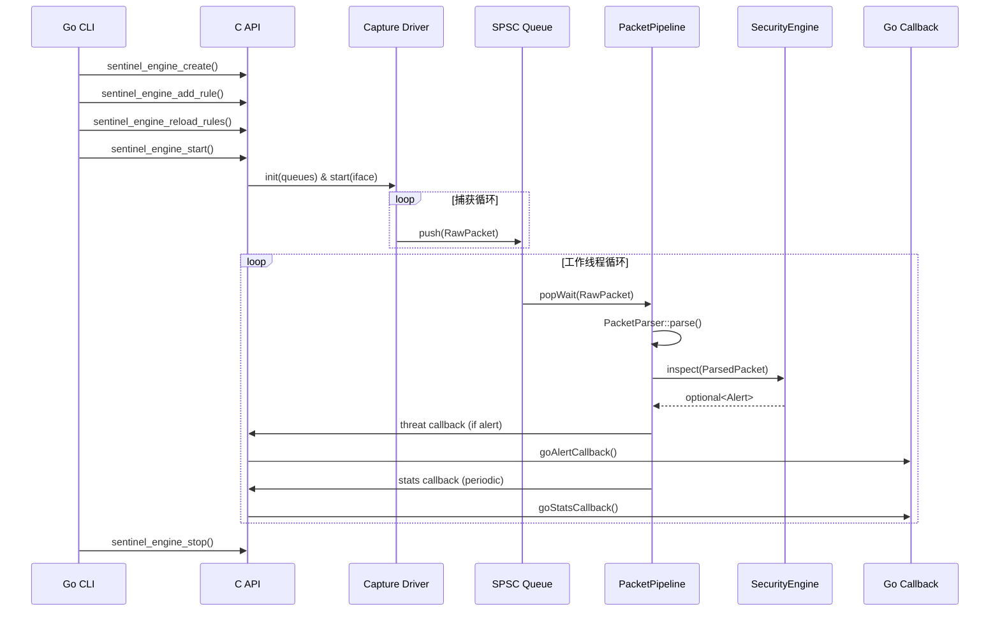

# Sentinel-Flow 架构设计

## 1. 概述

Sentinel-Flow 采用 **C++ 高性能数据面 + Go 轻量控制面** 的分离式架构。数据面负责实时流量捕获、协议解析、威胁检测与证据留存，以 C++20 编写并编译为静态库；控制面由 Go 语言 CLI 工具实现，通过 CGO 绑定调用 C API，完成配置管理、规则下发及监控反馈。该设计兼顾了高性能底层处理与上层快速迭代的灵活性。

## 2. 整体架构图



## 3. 分层详解

### 3.1 控制面（Go 层）

**位置**：`cmd/sentinel/`、`pkg/engine/`

**职责**：

- 解析命令行参数（接口、规则路径、线程数等）
- 通过 CGO 调用 `sentinel_engine_create` 初始化引擎上下文
- 动态构建规则结构体，调用 `sentinel_engine_add_rule` 和 `sentinel_engine_reload_rules` 下发规则
- 注册 Go 回调函数（`goAlertCallback`、`goStatsCallback`），接收来自 C++ 的告警与统计事件
- 监听系统信号，优雅停止引擎并释放资源

**关键交互**：

```go
handle := C.sentinel_engine_create(&conf)
C.sentinel_engine_set_callbacks(handle, alertCb, statsCb, nil)
C.sentinel_engine_add_rule(handle, &cRule)
C.sentinel_engine_reload_rules(handle)
C.sentinel_engine_start(handle)
```

### 3.2 C API 边界

**位置**：`libsentinel/include/sentinel/capi.h`、`libsentinel/src/capi_impl.cpp`

**职责**：

- 定义纯 C 接口，供 CGO 直接调用
- 封装 C++ 对象与智能指针，对外暴露不透明句柄 `SentinelEngineHandle`
- 管理 `EngineContext` 生命周期，持有捕获驱动、工作队列和流水线实例
- 将 Go 回调函数指针转换为 C++ 可调用的 `std::function`，并在检测线程中安全调用

**核心数据结构**：

```cpp
struct EngineContext {
    SentinelConfig config;
    OnAlertCallback alert_cb;
    OnStatsCallback stats_cb;
    void* user_data;
    ICaptureDriver* capture_driver;
    std::vector<std::unique_ptr<PacketPipeline>> pipelines;
    std::vector<std::unique_ptr<PacketQueue>> worker_queues;
};
```

### 3.3 捕获驱动层

**位置**：`libsentinel/src/capture/`

**职责**：

- 从网卡获取原始数据帧，支持两种后端：
  - **PcapCapture**：基于 libpcap，兼容性好，适用于通用场景。
  - **EBPFCapture**：基于 AF_XDP 零拷贝技术，性能极高，适用于万兆网络。
- 将原始包封装为 `RawPacket` 结构，通过轮询方式推入多个 `SPSCQueue`，实现多核负载分发。
- 驱动实现均为单例模式，全局仅一个实例运行。

**接口抽象**：

```cpp
class ICaptureDriver {
    virtual void init(const std::vector<PacketQueue*>& queues) = 0;
    virtual void start(const std::string& device) = 0;
    virtual void stop() = 0;
};
```

### 3.4 分发与队列层

**位置**：`libsentinel/src/common/queues/SPSCQueue.h`

**职责**：

- 提供单生产者单消费者（SPSC）无锁环形队列，作为捕获线程与工作线程之间的高速通道。
- 使用 `alignas(64)` 缓存行对齐避免伪共享。
- 支持带超时的阻塞等待 `popWait`，使工作线程在没有数据时高效休眠。

### 3.5 流水线处理层（PacketPipeline）

**位置**：`libsentinel/src/engine/pipeline/`

**职责**：

- 每个工作线程独占一个 `PacketPipeline` 实例和对应的输入队列。
- 循环从队列取出 `RawPacket`，调用 `PacketParser::parse()` 进行协议解析。
- 将解析后的 `ParsedPacket` 传递给 `IInspector`（即 `SecurityEngine`）进行威胁检测。
- 批量收集解析后的报文，通过 `std::shared_ptr` 传递给消费端（如 UI 或日志模块），实现零拷贝数据共享。
- 支持 CPU 亲和性绑定，减少线程迁移开销。

**核心运行循环**：

```cpp
while (running) {
    auto raw = inputQueue->popWait(100ms);
    auto parsed = PacketParser::parse(raw);
    if (auto alert = inspector->inspect(parsed)) {
        // 存储告警，触发回调
    }
    batch.emplace_back(parsed);
    if (batch full or timeout) flushBatch();
}
```

### 3.6 检测引擎（SecurityEngine）

**位置**：`libsentinel/src/engine/flow/SecurityEngine.h`

**职责**：

- 实现 `IInspector` 接口，提供核心检测能力。
- 内部集成 **Aho-Corasick 自动机**，支持多模式字符串匹配，时间复杂度 O(N) 且与规则数量无关。
- 规则通过 `addRule()` 动态添加，由 `compileRules()` 触发自动机构建。
- 维护 IP 黑名单（支持动态增删）和告警抑制缓存，避免重复报警。
- 检测到威胁后生成 `Alert` 结构，并调用 `DatabaseManager` 持久化，同时触发取证工作线程。

**规则管理线程安全**：使用 `std::shared_mutex` 保护规则列表，读多写少场景下并发性能极佳。

### 3.7 存储与取证

**位置**：`libsentinel/src/engine/context/DatabaseManager.cpp`、`libsentinel/src/engine/workers/ForensicWorker.h`

**职责**：

- `DatabaseManager`：封装 SQLite3 操作，启用 WAL 模式提升并发写入能力，所有数据库访问均加锁保护。
- `ForensicWorker`：独立后台线程，负责将高危告警对应的原始数据包写入 PCAP 文件，避免阻塞检测路径。

## 4. 数据流时序



## 5. 性能关键设计

- **无锁化**：捕获到检测全链路无互斥锁，仅使用原子操作和内存序保证可见性。
- **零拷贝**：`RawPacket` 使用对象池分配，`ParsedPacket` 通过 `shared_ptr` 批量传递，避免重复拷贝。
- **多核并行**：每个 CPU 核心运行独立的流水线，队列数与线程数一致，数据通过五元组哈希均匀分发。
- **批量处理**：工作线程以时间或数量为阈值批量提交结果，减少回调与 I/O 频率。
- **eBPF 卸载**：XDP 程序可在网卡驱动层直接过滤或转发数据包，进一步降低 CPU 负载。

## 6. 扩展点

- **新增捕获后端**：实现 `ICaptureDriver` 接口即可（如 DPDK、netmap）。
- **新增检测算法**：实现 `IInspector` 接口，并注入到 `PacketPipeline` 中。
- **新增回调类型**：在 `capi.h` 中扩展回调函数指针，并在 `capi_impl.cpp` 中调用。

## 7. 待优化项

- 当前 eBPF 探针未纳入 CMake 构建，需手动编译 `xdp_prog.c`。
- CLI 参数硬编码，需引入 `flag` 包增强灵活性。
- 规则 ID 解析依赖字符串截取，应改为直接传递整型字段。

