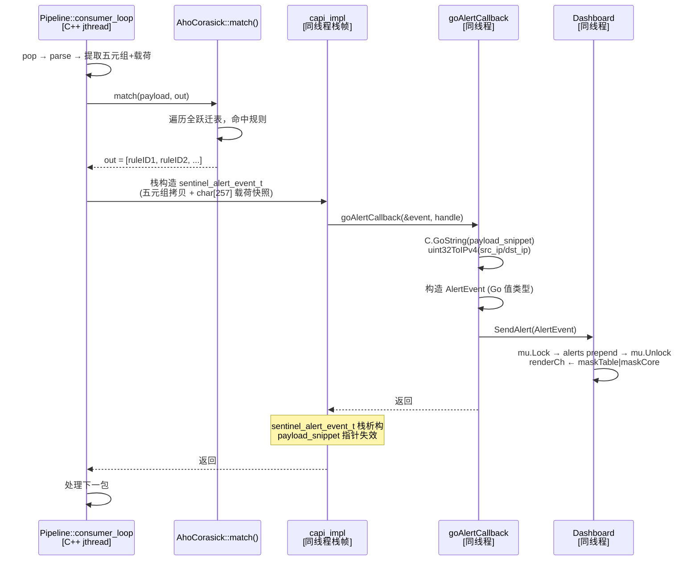
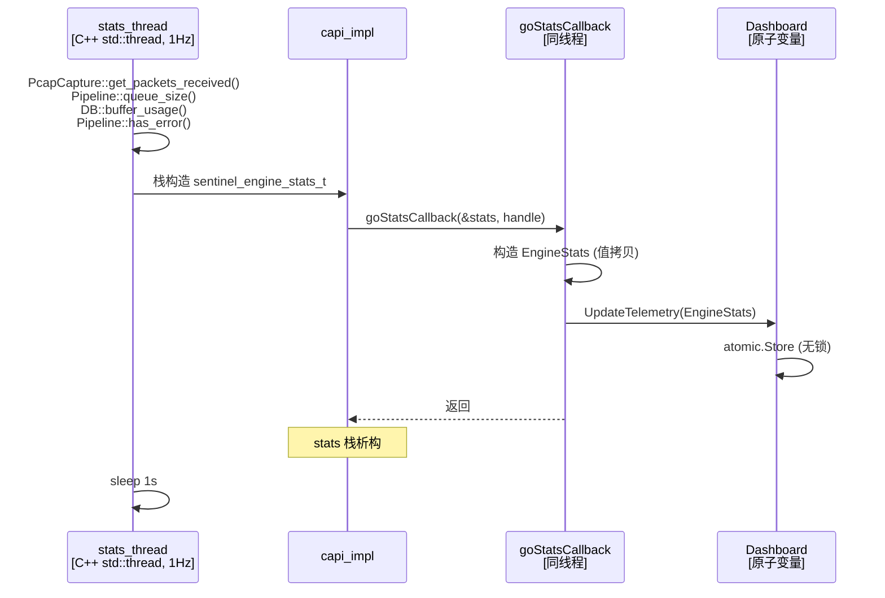

> **文档状态**: Active
> **最后更新**: 2026-06
> **所属子系统**: Core

# C/Go 边界规约

## 1. C API 接口清单

全部 8 个 `extern "C"` 导出函数 + 2 个回调类型 + 2 个数据交换结构体，声明于 `libsentinel/include/sentinel/capi.h`。

### 1.1 引擎生命周期

```c
sentinel_engine_t sentinel_engine_create(void);
void              sentinel_engine_destroy(sentinel_engine_t engine);
int               sentinel_engine_start(sentinel_engine_t engine, const char* device);
void              sentinel_engine_stop(sentinel_engine_t engine);
```

**调用时序约束**（强制，违反行为未定义）：

```
create → add_rule × N → build_matcher → set_alert_callback → set_stats_callback → start
  → [运行中可增删规则 + rebuild + 替换回调]
    → stop → destroy
```

**错误码语义**（`sentinel_engine_start` 返回值，实现于 `capi_impl.cpp`）：

| 返回值 | 含义 | 触发条件 |
|--------|------|----------|
| `0` | 成功 | 捕获驱动 + Pipeline 全部启动 |
| `-1` | 句柄无效 | `EngineContext*` 为 `nullptr` |
| `-2` | 捕获启动失败 | `ICapture::start()` 返回 false |

### 1.2 规则管理

```c
int  sentinel_engine_add_rule(sentinel_engine_t engine, const char* pattern, int rule_id);
void sentinel_engine_clear_rules(sentinel_engine_t engine);
int  sentinel_engine_build_matcher(sentinel_engine_t engine);
int  sentinel_engine_rule_count(sentinel_engine_t engine);
```

**行为说明**：

- `add_rule`: 逐条添加模式串与规则 ID。内部追加到待编译规则列表，不触发重建。
- `clear_rules`: 清空所有待编译规则。
- `build_matcher`: 基于已添加规则构建 AC 自动机（`insert` + `build`）。必须在所有 `add_rule` 之后、首次 `start` 之前调用。运行时热重载流程：`clear_rules` → `add_rule × N` → `build_matcher`。
- `rule_count`: 返回当前已添加规则数量。

**调用线程约束**：规则 API 可从任意 goroutine 调用。`build_matcher()` 在调用线程同步执行（阻塞直到构建完成）。

### 1.3 告警回调（五元组事件）

```c
// 告警事件结构体 — 完整五元组 + 内核纳秒时间戳 + 载荷快照。
// payload_snippet 指向栈临时缓冲区，仅在回调执行期间有效。
struct sentinel_alert_event_t {
    int         rule_id;
    uint32_t    src_ip;          // 网络字节序 IPv4 地址
    uint32_t    dst_ip;
    uint16_t    src_port;
    uint16_t    dst_port;
    uint8_t     protocol;        // IANA IP 协议号（IPPROTO_TCP=6, IPPROTO_UDP=17, IPPROTO_ICMP=1）
    int64_t     timestamp_ns;    // 内核纳秒时间戳（零精度损失）
    const char* payload_snippet; // 应用层载荷快照（栈分配，仅回调期间有效）
};

// 告警回调签名。
// event 指针及其 payload_snippet 仅在回调执行期间有效，调用方不得跨回调保存。
// user_data 为 Go 侧注册时透传的引擎句柄，用于回调路由。
typedef void (*sentinel_alert_callback_t)(const struct sentinel_alert_event_t* event,
                                          void* user_data);

void sentinel_engine_set_alert_callback(sentinel_engine_t engine,
                                        sentinel_alert_callback_t callback,
                                        void* user_data);
```

**C++ 侧实现要点**（`capi_impl.cpp`）：
- `sentinel_alert_event_t` 在 Pipeline 消费者线程栈上构造，零动态内存分配。
- `src_ip`/`dst_ip` 直接从 `ParsedPacket` 的 `uint32_t` 字段复制（网络字节序）。
- `payload_snippet` 指向栈上 `char[257]` 临时缓冲区（载荷截断至 256 字节 + 空终止符）。
- 回调返回后 `sentinel_alert_event_t` 立即析构，所有指针失效。

### 1.4 遥测统计回调

```c
// 引擎实时遥测统计量 — 后台统计线程约 1Hz 周期采样。
struct sentinel_engine_stats_t {
    uint64_t packets_received;  // 捕获驱动接收的数据包总数
    uint64_t packets_dropped;   // SPSC 队列溢出导致丢弃的数据包总数
    uint32_t queue_depth;       // SPSC 队列当前深度（近似值）
    uint32_t db_buffer_usage;   // 数据库前端缓冲区当前条目数（近似值）
    bool     has_fatal_error;   // 管线消费者线程是否已异常退出
};

// 统计遥测回调。约 1Hz 频率由独立统计线程周期调用。
// stats 指针仅在回调执行期间有效。
typedef void (*sentinel_stats_callback_t)(const struct sentinel_engine_stats_t* stats,
                                          void* user_data);

void sentinel_engine_set_stats_callback(sentinel_engine_t engine,
                                        sentinel_stats_callback_t callback,
                                        void* user_data);
```

**回调线程上下文**：统计回调在 C++ 统计线程（`std::thread`）上下文执行，非 Pipeline 线程。Go 侧回调处理函数负责线程安全（通常通过原子变量或通道传递至主 goroutine）。

---

## 2. Go 绑定实现

实现于 `pkg/engine/binding.go`。

### 2.1 CGO 编译参数

```go
// #cgo CFLAGS: -I${SRCDIR}/../../libsentinel/include
// #cgo LDFLAGS: -L${SRCDIR}/../../build/lib -lsentinel_core -lpcap -lstdc++ -lsqlite3 -lbpf -lxdp
```

| 链接库 | 使用方 | 用途 |
|--------|--------|------|
| `libsentinel_core.a` | 全部 C API | C++ 静态库（CMake 构建产物） |
| `libpcap` | PcapCapture | 数据包捕获 |
| `libsqlite3` | DatabaseManager | 告警持久化（WAL 模式） |
| `libbpf` | AfXdpCapture | AF_XDP 内核程序加载与 CO-RE 重定位 |
| `libxdp` | AfXdpCapture | AF_XDP 套接字与 UMEM 管理 |
| `libstdc++` | 全部 C++ 代码 | C++ 标准库 |

**注**：LDFLAGS 中的 `build/lib` 路径对应 CMake 构建输出目录。实际构建时根据 `CMAKE_BUILD_TYPE` 可能为 `build/lib`（Release）或 `cmake-build-debug/lib`（Debug）。

### 2.2 引擎封装

实现于 `pkg/engine/engine.go`。

```go
type Engine struct {
    handle C.sentinel_engine_t
}

func New() (*Engine, error) {
    handle := C.sentinel_engine_create()
    if handle == nil {
        return nil, fmt.Errorf("sentinel_engine_create 返回 NULL")
    }
    eng := &Engine{handle: handle}
    // 注册占位告警回调 + stats 回调路由
    registerAlertCallback(handle, func(event AlertEvent) {})
    registerStatsCallback(handle, func(stats EngineStats) {})
    // 设置 C 侧回调
    C.sentinel_engine_set_alert_callback(handle,
        (C.sentinel_alert_callback_t)(C.goAlertCallback),
        unsafe.Pointer(handle))
    C.sentinel_engine_set_stats_callback(handle,
        (C.sentinel_stats_callback_t)(C.goStatsCallback),
        unsafe.Pointer(handle))
    return eng, nil
}
```

### 2.3 告警回调路由（五元组事件）

```go
// AlertEvent 表示一条完整的五元组告警事件（Go 侧视图）。
type AlertEvent struct {
    RuleID         int
    SrcIP          string // 点分十进制 IPv4，由 uint32ToIPv4 转换
    DstIP          string
    SrcPort        uint16
    DstPort        uint16
    Protocol       string // "TCP" / "UDP" / "ICMP" / …
    ProtocolIANA   uint8
    TimestampNs    int64
    PayloadSnippet string
}

//export goAlertCallback
func goAlertCallback(event *C.struct_sentinel_alert_event_t, userData unsafe.Pointer) {
    cb := lookupAlertCallback(userData)
    if cb != nil {
        cb(AlertEvent{
            RuleID:         int(event.rule_id),
            SrcIP:          uint32ToIPv4(uint32(event.src_ip)),
            DstIP:          uint32ToIPv4(uint32(event.dst_ip)),
            SrcPort:        uint16(event.src_port),
            DstPort:        uint16(event.dst_port),
            Protocol:       ianaProtocolName(uint8(event.protocol)),
            ProtocolIANA:   uint8(event.protocol),
            TimestampNs:    int64(event.timestamp_ns),
            PayloadSnippet: C.GoString(event.payload_snippet),
        })
    }
}
```

**路由流程**：Go 侧 `SetAlertCallback(cb)` → `alertRegistry[handle] = cb` → C++ Pipeline 触发告警 → C++ 栈构造 `sentinel_alert_event_t` → `goAlertCallback` → Go 侧全部字段拷贝（`C.GoString` + 数值转换） → 调用闭包 → Dashboard。

### 2.3 统计回调路由

```go
// EngineStats 对应 C 侧 sentinel_engine_stats_t。
type EngineStats struct {
    PacketsReceived uint64
    PacketsDropped  uint64
    QueueDepth      uint32
    DBBufferUsage   uint32
    HasFatalError   bool
}

//export goStatsCallback
func goStatsCallback(stats *C.struct_sentinel_engine_stats_t, userData unsafe.Pointer) {
    cb := lookupStatsCallback(userData)
    if cb != nil {
        cb(EngineStats{
            PacketsReceived: uint64(stats.packets_received),
            PacketsDropped:  uint64(stats.packets_dropped),
            QueueDepth:      uint32(stats.queue_depth),
            DBBufferUsage:   uint32(stats.db_buffer_usage),
            HasFatalError:   bool(stats.has_fatal_error),
        })
    }
}
```

---

## 3. 内存所有权模型

### 3.1 Go → C 方向（Go 分配，Go 释放）

**模式一：C 字符串（短期）**

```go
// engine.go - Start(iface)
cIface := C.CString(iface)
defer C.free(unsafe.Pointer(cIface))
code := C.sentinel_engine_start(eng.handle, cIface)
```

规则：`C.CString()` 在 C 堆分配，`defer C.free()` 在函数返回时释放。C++ 侧通过 `std::string` 拷贝语义接管数据，不持有 Go 侧原始指针。

**模式二：规则字符串（批量）**

```go
// engine.go - AddRule(pattern, ruleID)
cPattern := C.CString(pattern)
defer C.free(unsafe.Pointer(cPattern))
code := C.sentinel_engine_add_rule(eng.handle, cPattern, C.int(ruleID))
```

每条规则调用一次 `add_rule`。C++ 侧在 `add_rule` 内部拷贝 `pattern` 到 `std::string`，不持有原始指针。

### 3.2 C → Go 方向（C++ 栈分配，Go 立即拷贝）

**`goAlertCallback` 指针语义**：

```go
func goAlertCallback(event *C.struct_sentinel_alert_event_t, userData unsafe.Pointer) {
    // event 指向 C++ Pipeline 消费者线程栈上构造的 sentinel_alert_event_t。
    // event->payload_snippet 指向同一栈帧内的 char[257] 缓冲区。
    // 回调返回后 event 指针和 payload_snippet 均立即失效 —— 必须同步拷贝全部字段。
    payload := C.GoString(event.payload_snippet)  // Go 堆分配副本
    ip := uint32ToIPv4(uint32(event.src_ip))       // 栈分配值类型副本
    cb(AlertEvent{...})  // 全部字段为 Go 侧值/字符串副本
}
```

**关键约束**：
- `event` 和 `event->payload_snippet` 仅在回调函数栈帧内有效
- `C.GoString()` 创建 Go 侧字符串副本，回调返回后 C 指针不再可用
- 数值字段（`src_ip`/`src_port` 等）直接值拷贝，无生命周期问题
- 回调内部不得保存 `event` 或 `payload_snippet` 原始指针
- 回调内部禁止执行新的 CGO 调用（防止重入）

### 3.3 EngineContext 生命周期

```
create() → new EngineContext (C++ heap)
            ├── capture driver = nullptr
            ├── rule storage 初始化
            └── stats thread 启动 (1Hz)
add_rule() → pendingPatterns 追加
build_matcher() → AhoCorasick::insert × N → build()
  → atomic<shared_ptr<Matcher>>::store (release)
set_stats_callback() → 注册 1Hz 统计遥测回调
start() → new CaptureDriver(Pcap/AfXdp) + new Pipeline + 捕获线程 + 管线线程
stop()  → capture->stop() + pipeline->stop() + 线程 join
destroy() → stop() + delete EngineContext + stats thread join
```

`destroy` 后句柄失效，任何后续调用行为未定义。

---

## 4. CGO 回调链路时序



**时序约束**：
- `sentinel_alert_event_t` 在 Pipeline 消费者线程栈上构造和析构
- `event->payload_snippet` 指向栈上 `char[257]`，不可跨回调保存
- 回调内部同步拷贝（`C.GoString` + 数值转换）后数据由 Go GC 管理
- Dashboard `mu.Lock` 持有时间极短（`append` + `slice`）

**性能关键点**：

- CGO 调用开销约 50-100ns（Go ↔ C 栈帧切换 + `runtime.cgocall`）
- `C.GoString` 在 C 堆上分配 + 拷贝（O(N)，N ≤ 256 字节）
- `uint32ToIPv4` 为纯 Go 栈分配格式化（~20ns）
- Go 回调内原子操作延迟约 10-20ns

---

## 5. 统计回调链路（独立路径）



**时序约束**：
- 统计线程独立于 Pipeline 消费者线程，避免竞争消费速率
- `has_fatal_error` 检测：Go 侧在 stats 回调中检查此标志 → 触发 `dash.Quit()` 安全关机
- Go 侧 `UpdateTelemetry` 使用 `atomic.Store`（非阻塞，不竞争 termui 主线程）

---

## 6. 错误传播路径

```
C++ 内部错误
  └→ sentinel_engine_start(capi_impl.cpp)
       └→ ICapture::start() 返回 false → return -2

C++ 运行时异常（consumer_loop）
  └→ try/catch → SENTINEL_ERROR 日志 → error_state_ = true
       → stats thread 读取 has_error → goStatsCallback → Dashboard 检测 → dash.Quit()

Go 侧 (engine.go)
  └→ eng.Start() 检测 code != 0 → fmt.Errorf("引擎启动失败, 错误码: %d", code)

CLI 入口 (main.go)
  └→ fmt.Fprintf(os.Stderr, ...) → os.Exit(1)
```

当前局限：C++ 内部错误信息通过 spdlog 异步日志输出，不经过返回值传递。Go 侧仅获取错误码，无法获取详细错误描述。未来可扩展 `sentinel_engine_get_last_error()` 模式。
