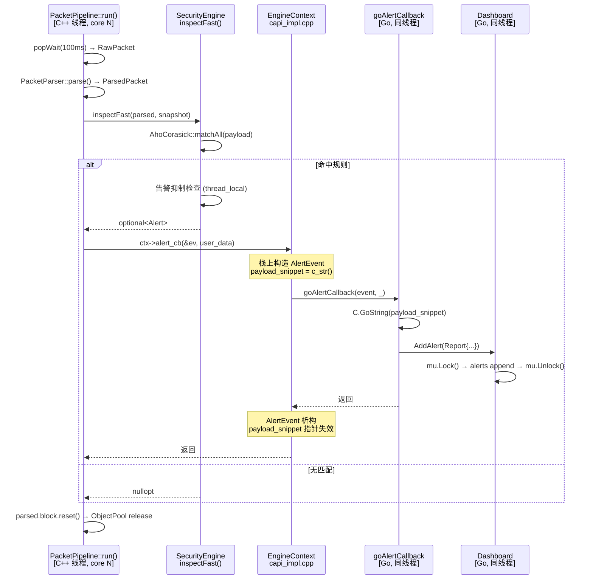

# C/Go 边界规约

## 1. C API 接口清单

全部 8 个 `extern "C"` 导出函数，声明于 `libsentinel/include/sentinel/capi.h`。

### 1.1 生命周期管理

```c
SentinelEngineHandle sentinel_engine_create(const SentinelConfig* config);
void sentinel_engine_set_callbacks(SentinelEngineHandle handle,
    OnAlertCallback alert_cb, OnStatsCallback stats_cb, void* user_data);
int  sentinel_engine_start(SentinelEngineHandle handle);
void sentinel_engine_stop(SentinelEngineHandle handle);
void sentinel_engine_destroy(SentinelEngineHandle handle);
```

**调用时序约束**（强制，违反未定义）：

```
create → set_callbacks → start → [运行中可调用规则 API] → stop → destroy
```

**错误码语义**（参考 `sentinel_engine_start` 返回值，定义于 `capi_impl.cpp:96-186`）：

| 返回值 | 含义 | 触发条件 |
|--------|------|----------|
| `0` | 成功 | 捕获驱动 + Pipeline 全部启动 |
| `-1` | 句柄无效 | `EngineContext*` 为 `nullptr` |
| `-2` | 离线模式启动失败 | `PcapCapture::start(offline_pcap)` 返回 false |
| `-3` | 在线/ebpf 启动失败 | `PcapCapture::start(iface)` 或 `EBPFCapture::start(iface)` 返回 false |

### 1.2 规则管理

```c
void sentinel_engine_clear_rules(SentinelEngineHandle handle);
void sentinel_engine_add_rule(SentinelEngineHandle handle, const SentinelRule* rule);
int  sentinel_engine_reload_rules(SentinelEngineHandle handle);
void sentinel_engine_load_rules(SentinelEngineHandle handle,
    const SentinelRule* rules, int count);
```

**行为差异**：

- `add_rule` + `reload_rules`：逐条添加，调用 `reload_rules` 时触发一次 AC 自动机重建。适用于交互式规则管理。
- `load_rules`：原子操作 = `clearRules()` → 循环 `addRule()` → `compileRules()`（实现于 `capi_impl.cpp:79-93`）。内部每步持有 `pendingMutex`，但三次加锁之间存在窗口。Go 侧已通过 `engineCreateMu sync.Mutex` 串行化所有引擎创建操作（`binding.go:89,92-93`），避免并发 `load_rules`。

**调用线程约束**：规则 API 可从任意 goroutine 调用。`compileRules()` 在调用线程同步执行（非异步）。

### 1.3 回调类型定义

```c
typedef void (*OnAlertCallback)(const AlertEvent* event, void* user_data);
typedef void (*OnStatsCallback)(const EngineStats* stats, void* user_data);
```

调用线程 = Pipeline 工作线程（C++ `std::thread`），非 Go goroutine（`capi_impl.cpp:131-153`）。

---

## 2. 内存所有权模型

### 2.1 Go → C 方向（Go 分配，Go 释放）

**模式一：C 字符串**

```go
// binding.go:96-99
cIface := C.CString(iface)
cRules := C.CString(rulesPath)
defer C.free(unsafe.Pointer(cIface))
defer C.free(unsafe.Pointer(cRules))
```

规则：`C.CString()` 在 C 堆分配，`defer C.free()` 在函数返回时释放。C++ 侧 `EngineContext` 在 `sentinel_engine_create` 中通过 `std::string` 拷贝语义接管数据（`capi_impl.cpp:36-41`），不持有 Go 侧原始指针。

**模式二：规则数组批量传输**

```go
// binding.go:186-214
cRules := make([]C.SentinelRule, len(rules))
cStrings := make([]*C.char, 0, len(rules)*3)
for i, r := range rules {
    cp := C.CString(r.Protocol)
    cn := C.CString(r.Pattern)
    cd := C.CString(r.Description)
    cStrings = append(cStrings, cp, cn, cd)
    cRules[i] = C.SentinelRule{...}
}
C.sentinel_engine_load_rules(e.handle, &cRules[0], C.int(len(rules)))
for _, s := range cStrings {
    C.free(unsafe.Pointer(s))
}
```

生命周期：Go 分配 `[]C.SentinelRule` 数组 + 每个 `C.CString` → 调用 C 函数（C++ 侧逐元素拷贝到 `IdsRule` → `pendingRules`） → Go 侧 `C.free` 释放所有 C 字符串。`cRules` 切片在函数返回时由 Go GC 回收。

### 2.2 C → Go 方向（C++ 栈分配，Go 只读）

**`goAlertCallback` 指针语义**：

```go
// binding.go:34-58
func goAlertCallback(event unsafe.Pointer, userData unsafe.Pointer) {
    ev := (*C.AlertEvent)(event)
    // ev 指向 C++ 栈上的 AlertEvent 临时对象
    // 回调返回后指针立即失效
    desc := C.GoString(ev.payload_snippet)
    // ...
}
```

`AlertEvent` 在 C++ 侧构造为栈变量（`capi_impl.cpp:134-139`）。`payload_snippet` 指向 C++ `std::string::c_str()`，该 `string` 在回调返回后析构。

**`goStatsCallback` 同理**（`capi_impl.cpp:144-152`，`binding.go:62-72`）。

**关键约束**：回调内不得保存指针或执行新的 CGO 调用。Go 侧必须立即拷贝所需数据（`C.GoString`、`uint32` 赋值等）。

### 2.3 EngineContext 生命周期

```
create() → new EngineContext (C++ heap)
            ├── config 拷贝
            └── persistent_* 字符串拷贝
start()  → new SPSCQueue[] + new PacketPipeline[] + 捕获线程
stop()   → capture_driver->stop() + 线程 join
destroy()-> sentinel_engine_stop() + delete ctx
```

`destroy` 后句柄失效，任何后续调用行为未定义。

---

## 3. CGO 回调链路时序



**时序约束**：
- `AlertEvent` 指针仅在回调函数栈帧内有效——Go 侧必须同步拷贝完所需数据
- `payload_snippet` 指向 C++ `std::string::c_str()`，不可跨回调保存
- 回调内部禁止执行新的 CGO 调用（防止重入）

**性能关键点**：

- CGO 调用开销约 50-100ns（Go ↔ C 栈帧切换 + `runtime.cgocall`）
- C → Go 回调开销同量级
- `unsafe.Pointer` 强制转换无额外拷贝
- Go 回调内原子操作（`globalStatsRecv.Store`）延迟约 10-20ns

---

## 4. CGO 编译链接参数

```go
// binding.go:4-5
// #cgo CFLAGS: -I${SRCDIR}/../../libsentinel/include
// #cgo LDFLAGS: -L${SRCDIR}/../../build/libsentinel
//              -lsentinel_core -lpcap -lbpf -lxdp -lsqlite3 -latomic -lpthread -lstdc++
```

| 链接库 | 使用方 | 用途 |
|--------|--------|------|
| `libsentinel_core.a` | 全部 C API | C++ 静态库（CMake 构建产物） |
| `libpcap` | PcapCapture / ForensicWorker | 抓包 + PCAP 文件写入 |
| `libbpf` + `libxdp` | EBPFCapture | eBPF 程序加载 + AF_XDP socket |
| `libsqlite3` | DatabaseManager | 告警/规则持久化 |
| `libatomic` | SPSCQueue / ObjectPool / GlobalStats | `std::atomic` 运行时支持 |
| `libpthread` | PacketPipeline / 各线程 | `pthread_setaffinity_np` |
| `libstdc++` | 全部 C++ 代码 | C++ 标准库 |

---

## 5. 错误传播路径

```
C++ 内部错误
  └→ sentinel_engine_start(capi_impl.cpp:159-186)
       ├→ 离线模式: PcapCapture::start() 返回 false → return -2
       ├→ 在线模式 (pcap): PcapCapture::start() 返回 false → return -3
       └→ 在线模式 (ebpf): EBPFCapture::start() 返回 false → return -3

Go 侧 (binding.go:142-148)
  └→ e.Start() 检测 errCode != 0 → fmt.Errorf("engine driver start failed, error code: %d")

CLI 入口 (main.go:87-90)
  └→ 打印错误到 stderr → os.Exit(1)
```

当前局限：C++ 内部错误信息通过 `std::cerr` 输出，不经过返回值传递。Go 侧仅获取错误码，无法获得 C++ 内部的详细错误描述。未来需扩展为 `sentinel_engine_get_last_error()` 模式。
