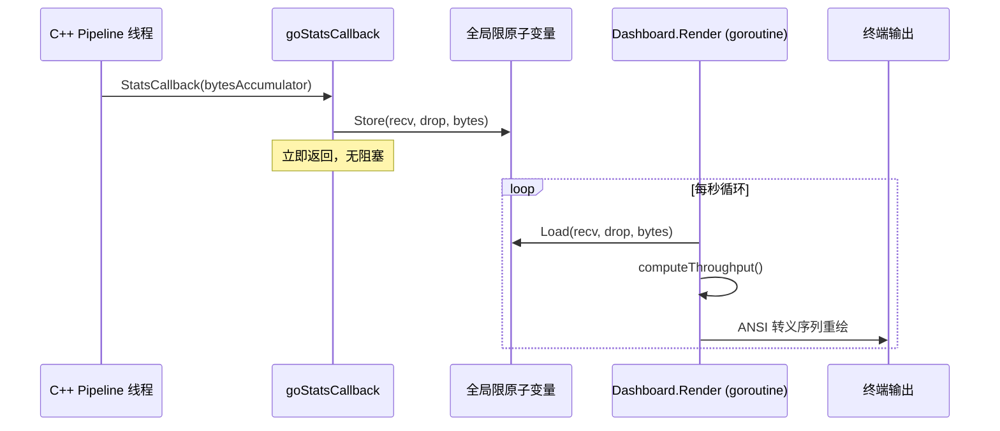

# 终端仪表盘 (Dashboard)

## 概述

`Dashboard` 是 Sentinel-Flow Go CLI 的实时终端可视化组件，负责将 C++ 数据面的运行状态、告警事件以 ANSI 终端的彩色界面形式呈现给操作员。它运行在独立的 goroutine 中，通过每秒刷新一次来更新显示，同时从 C++ 统计回调函数异步接收数据。

## 设计目标

- **实时可见性**：在终端中持续刷新运行状态，无需外部监控工具即可了解引擎健康状况。
- **线程安全**：通过原子操作与互斥锁组合，安全处理来自多个 C++ 检测线程的并发回调。
- **低侵入性**：回调函数内部仅执行轻量级原子存储，避免阻塞 C++ 数据面的检测管线。
- **优雅降级**：在无告警时显示占位信息，确保界面始终保持可读性。

## 核心数据结构

```go
type Dashboard struct {
    mu sync.Mutex

    startTime time.Time   // 引擎启动时刻
    iface     string      // 网络接口名称
    mode      string      // 运行模式 (live / offline / ebpf)
    backend   string      // 捕获后端 (libpcap / AF_XDP)
    workers   int         // 工作线程数
    rules     int         // 已加载规则数
    verbose   bool        // 详细日志模式

    // 累积计数器（来自 C++ 的快照）
    packetsRecv uint64
    packetsDrop uint64
    bytesRecv   uint64

    // 增量计算
    lastBytesRecv uint64
    lastBytesTime time.Time
    throughputBps float64

    // 告警循环缓冲区
    alerts   []Report
    alertMax int

    // 渲染状态
    frameCount int
    liveLines  int   // 实时区域所占的行数
}
```

### 全局限原子变量

为避免 C++ 回调在持有互斥锁时长时间阻塞，仪表盘使用以下全局原子变量作为 C++ 回调与 Go 渲染循环之间的无锁桥梁：

```go
var (
    globalStatsRecv  atomic.Uint64   // 已接收包总数
    globalStatsDrop  atomic.Uint64   // 已丢弃包总数
    globalStatsBytes atomic.Uint64   // 已处理字节总数
    globalStatsDirty atomic.Bool     // 脏数据标记（预留）
)
```

## 数据流



## 统计刷新机制

### 吞吐量计算

```go
func (d *Dashboard) computeThroughput() {
    now := time.Now()
    bytes := globalStatsBytes.Load()
    elapsed := now.Sub(d.lastBytesTime).Seconds()
    if elapsed >= 0.5 {
        delta := float64(bytes - d.lastBytesRecv)
        d.throughputBps = delta / elapsed
        d.lastBytesRecv = bytes
        d.lastBytesTime = now
    }
}
```

- 最小更新间隔为 **0.5 秒**，防止抖动造成不稳定的显示值。
- 吞吐量单位为 B/s，自动转换为 KB/s、MB/s、GB/s 等可读格式。

### 渲染循环

```go
func (d *Dashboard) Run(stopCh <-chan struct{}) {
    ticker := time.NewTicker(1 * time.Second)
    defer ticker.Stop()

    fmt.Print("\033[?25l")       // 隐藏光标
    defer fmt.Print("\033[?25h") // 退出时恢复光标

    for {
        select {
        case <-ticker.C:
            d.Render()
        case <-stopCh:
            return
        }
    }
}
```

- **刷新频率**：每秒 1 次。
- **光标控制**：渲染时隐藏光标（`\033[?25l`），退出时恢复，确保终端整洁。
- **ANSI 转义**：使用 `\033[K`（清除行）和 `\033[%dA`（向上移动）实现原地重绘。

## 终端界面布局

```
╔═════════════════════════════════════════════════════╗
║  Sentinel-Flow  v2.0.0                              ║
║  Network Intrusion Detection System                 ║
╠═════════════════════════════════════════════════════╣
║  Interface: eth0          Mode:  Live (libpcap)     ║
║  Workers:   4             Rules: 3 loaded            ║
║  Backend:   libpcap                                ║
╚═════════════════════════════════════════════════════╝

┌── Live Statistics ──────────────────────────────────┐
│  Packets    12.5K recv  │  Dropped       123 (0.98%) │
│  Bytes      3.2M        │  Throughput  1.2 MB/s     │
│  Uptime          1h23m  │  Alerts            5      │
├── Recent Alerts ────────────────────────────────────┤
│  [HIGH] 15:04:05  Rule 1001  SQL Injection Detected │
│  [MED]  15:03:52  Rule 1002  XSS Attempt            │
│  [LOW]  15:03:30  Rule 1003  Suspicious User-Agent  │
│                                                      │
│                                                      │
└──────────────────────────────────────────────────────┘
  Press Ctrl+C to stop
```

## 颜色编码

告警等级终端颜色映射关系：

| 等级   | ANSI 序列       | 颜色效果     |
|--------|-----------------|-------------|
| CRIT   | `\033[1;35m`   | 粗体品红     |
| HIGH   | `\033[1;31m`   | 粗体红色     |
| MED    | `\033[33m`     | 黄色         |
| LOW    | `\033[32m`     | 绿色         |
| INFO   | `\033[37m`     | 白色         |

颜色函数实现：

```go
func levelCode(level string) string {
    switch level {
    case "CRIT": return "\033[1;35m"
    case "HIGH": return "\033[1;31m"
    case "MED":  return "\033[33m"
    case "LOW":  return "\033[32m"
    default:     return "\033[37m"
    }
}
```

## 告警循环缓冲区

告警记录保存在固定容量的循环缓冲区中：

```go
func (d *Dashboard) AddAlert(r Report) {
    d.mu.Lock()
    defer d.mu.Unlock()
    if len(d.alerts) >= d.alertMax {
        d.alerts = d.alerts[1:]   // 丢弃最旧的告警
    }
    d.alerts = append(d.alerts, r)
}
```

- **容量**：`alertMax = 5`，界面中最多显示 5 条最近告警。
- **淘汰策略**：FIFO — 新告警到达时，最旧的告警被移除。
- **线程安全**：使用 `sync.Mutex` 保护 `alerts` 切片。

## 关机摘要

引擎收到 SIGINT/SIGTERM 时打印最终统计汇总：

```
── Shutdown Summary ───────────────────────────────
  Uptime:      1h23m45s
  Received:    125000 packets
  Dropped:     123 packets (0.10%)
  Alerts:      5 total
  Exit code:   0 (clean)
──────────────────────────────────────────────────
```

## C++ 回调集成

Dashboard 通过 `binding.go` 中的 `SetDashboard()` 注入为全局单例。C++ 统计回调在不同检测线程上执行，直接调用 `UpdateStats()`：

```go
//export goStatsCallback
func goStatsCallback(stats unsafe.Pointer, userData unsafe.Pointer) {
    st := (*C.EngineStats)(stats)
    if globalDashboard == nil {
        return
    }
    globalDashboard.UpdateStats(
        uint64(st.total_packets_received),
        uint64(st.total_packets_dropped),
        uint64(st.current_qps),
    )
}
```

- **非阻塞约定**：回调仅执行原子 `Store` 操作，不会获取 Dashboard 的内部互斥锁。
- **多线程安全**：`sync/atomic` 包保证来自多个 C++ 工作线程并发写入的安全性。

## 使用示例

```go
// 创建仪表盘
dash := engine.NewDashboard("eth0", "live", "libpcap", 4, 12, false)

// 注册为全局单例（供 C 回调函数使用）
engine.SetDashboard(dash)

// 打印启动横幅
dash.PrintBanner()

// 启动渲染循环（在 goroutine 中）
stopCh := make(chan struct{})
go dash.Run(stopCh)

// ... 引擎运行中 ...

// 优雅关闭
close(stopCh)
dash.PrintSummary()
```

## 配置参数

| 参数          | 默认值 | 说明                           |
|---------------|--------|--------------------------------|
| `alertMax`    | 5      | 界面上显示的告警数量上限        |
| `liveLines`   | 12     | 实时更新区域占用的终端行数       |
| 刷新间隔      | 1 s    | 全界面重绘间隔                  |
| 吞吐量更新    | 0.5 s  | 最小吞吐量重新计算间隔          |
