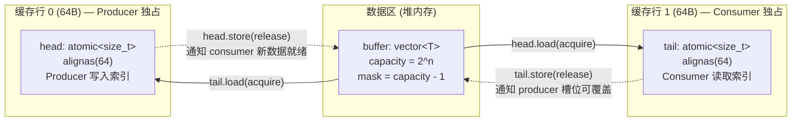

> **文档状态**: Active
> **最后更新**: 2026-06
> **所属子系统**: Core

# 无锁内存模型规约

## 1. 热路径组件清单

以下组件在数据面热路径（捕获 → 解析 → 匹配）中运行，全程零 mutex：

| 组件 | 文件 | 并发模式 | 内存序策略 |
|------|------|----------|-----------|
| `SPSCQueue` | `common/SPSCQueue.h` | 单生产者 / 单消费者 | `acquire` / `release` |
| `ObjectPool<MemoryBlock>` | `common/memory/ObjectPool.h` | 多生产者 / 多消费者（无锁栈） | CAS + Tagged Pointer |

**非热路径 mutex**（不在检测管线内）——见第 5 节。

---

## 2. SPSCQueue — 内存序逐行分析

源码：`libsentinel/include/sentinel/common/SPSCQueue.h`

### 2.0 环形缓冲区内存布局



### 2.1 `push(T value)` — 生产者

```cpp
bool push(T value) {
    size_t h = head.load(std::memory_order_relaxed);   // (1)
    size_t t = tail.load(std::memory_order_acquire);   // (2)
    if (((h + 1) & mask) == t) return false;           // 队列满
    buffer[h] = std::move(value);                      // (3) 数据写入
    head.store((h + 1) & mask, std::memory_order_release); // (4)
    return true;
}
```

| 行 | 操作 | 内存序 | 理由 |
|----|------|--------|------|
| (1) | `head.load` | `relaxed` | 单生产者独写 `head`，无需同步其他 producer |
| (2) | `tail.load` | `acquire` | 与 consumer 的 `release` 配对。保证 consumer 已读取的槽位可安全覆盖 |
| (3) | `buffer[h] = move` | — | 普通写入。`head.store(release)` 保证此写入在 (4) 之前对所有线程可见 |
| (4) | `head.store` | `release` | 与 consumer 的 `acquire` 配对。保证 buffer[h] 的内容对 consumer 可见 |

### 2.2 `popWait(timeout)` — 消费者

```cpp
std::optional<T> popWait(std::chrono::milliseconds timeout) {
    size_t t = tail.load(std::memory_order_relaxed);   // (5)
    // spin-wait loop ...
    size_t h = head.load(std::memory_order_acquire);   // (6)
    T value = std::move(buffer[t]);                    // (7) 数据读取
    tail.store((t + 1) & mask, std::memory_order_release); // (8)
    return value;
}
```

| 行 | 操作 | 内存序 | 理由 |
|----|------|--------|------|
| (5) | `tail.load` | `relaxed` | 单消费者独写 `tail`，无需同步其他 consumer |
| (6) | `head.load` | `acquire` | 与 producer 的 `release` 配对。保证 producer 的 buffer 写入对 consumer 可见 |
| (7) | `buffer[t] = move` | — | 在 `acquire` 之后，producer 的写入已全部可见 |
| (8) | `tail.store` | `release` | 与 producer 的 `acquire` 配对。保证 consumer 已完成读取，槽位可被覆盖 |

### 2.3 容量约束

- `capacity` 必须为 2 的幂（`(capacity & (capacity - 1)) == 0`）
- 位掩码 `mask = capacity - 1` 替代取模运算
- 单生产者 / 单消费者前提：违反此约束导致数据竞争，行为未定义

### 2.4 伪共享防护

```cpp
alignas(64) std::atomic<size_t> head{0};
alignas(64) std::atomic<size_t> tail{0};
```

`head` 和 `tail` 各自独占 64 字节缓存行。producer 仅写 `head`、consumer 仅写 `tail`，不会因缓存一致性协议互相 invalidate 对方缓存行。

---

## 3. ObjectPool — Tagged Pointer ABA 防护

源码：`libsentinel/include/sentinel/common/memory/ObjectPool.h`

### 3.1 核心结构

```cpp
struct alignas(16) TaggedHead {
    PoolBlock* ptr = nullptr;   // 空闲链表头指针
    std::uint64_t tag = 0;      // 版本计数器（单调递增）
};
alignas(64) std::atomic<TaggedHead> freeHead_{TaggedHead{nullptr, 0}};
```

### 3.2 `popFree_()` — CAS 弹出

```cpp
PoolBlock* popFree_() noexcept {
    TaggedHead head = freeHead_.load(std::memory_order_acquire);   // (A)
    while (head.ptr) {
        PoolBlock* node = head.ptr;
        TaggedHead next{node->next, head.tag + 1};                // (B)
        if (freeHead_.compare_exchange_weak(head, next,           // (C)
                std::memory_order_acq_rel, std::memory_order_acquire)) {
            node->next = nullptr;
            return node;
        }
    }
    return nullptr;
}
```

| 行 | 操作 | 内存序 | 理由 |
|----|------|--------|------|
| (A) | `load` | `acquire` | 与释放线程的 `release` 配对，保证 `node->next` 可见 |
| (B) | `tag + 1` | — | 每次操作递增 tag，使 CAS 的 `(ptr, tag)` 对唯一 |
| (C) | `compare_exchange_weak` | `acq_rel`（成功）/ `acquire`（失败） | 成功时 release 语义使 node 读取对其他线程可见；失败时 acquire 重读最新值 |

### 3.3 ABA 场景推演

```
时刻 T0: freeHead = {ptr: X, tag: N}
T1: Thread A 执行 (A)，读到 head = {X, N}
T2: Thread A 被抢占
T3: Thread B 执行 popFree → pop X → pushFree(X)
    此时 freeHead = {ptr: X, tag: N+1}
T4: Thread C 执行 popFree → pop X → pushFree(X)
    此时 freeHead = {ptr: X, tag: N+2}
T5: Thread A 恢复，执行 CAS({X, N}, {X->next, N+1})
    CAS 比较: 期望 head = {X, N}，实际 head = {X, N+2}
    → 指针相同但 tag 不同 → CAS 失败 → 重试
    → 避免了将已释放并重新分配的 X 再次弹出
```

无 tag 时，Thread A 的 CAS 会在 T5 成功，导致 X 被双重弹出 → 数据竞争 / use-after-free。

### 3.4 `pushFree_()` — CAS 压入

```cpp
void pushFree_(PoolBlock* node) noexcept {
    TaggedHead head = freeHead_.load(std::memory_order_acquire);
    for (;;) {
        node->next = head.ptr;
        TaggedHead next{node, head.tag + 1};
        if (freeHead_.compare_exchange_weak(head, next,
                std::memory_order_release, std::memory_order_acquire)) {
            return;
        }
    }
}
```

`release` 语义保证 `node->next` 的更新对其他线程的 `popFree_` 可见。

### 3.5 非热路径 mutex

```cpp
std::mutex m_allocMutex_;  // ObjectPool.h
```

仅在 `allocateOne_()` 中触发——当空闲链表为空（池耗尽）时动态分配新节点。正常运行时不会触发此路径。

---

## 4. AhoCorasick 匹配 — 单线程只读

`AhoCorasick::match()` 为 const 方法，不修改任何内部状态。全跃迁表（`next[256]`）在 `build()` 阶段一次性填充，运行时仅读取。

**并发模型**：匹配操作可由任意线程并发执行（只读共享），但 `build()` 与 `match()` 不可并发——调用方（Go 侧 `applyRules`）通过 `reloadMu sync.Mutex` 保证重建期间无并发匹配。

**未构建守卫**：`match()` 开头检查 `if (!built_) return false/nullptr`，防止在 `build()` 之前或规则清空后的未初始化状态调用。

---

## 5. 非热路径 Mutex 清单（完整性）

| 位置 | 锁类型 | 保护对象 | 触发频率 | 路径类型 |
|------|--------|----------|----------|----------|
| `DatabaseManager::queueMutex` | `std::mutex` | 双缓冲 alertQueue 轮转 | 每批告警一次 | I/O 线程 |
| `PcapCapture::handleMutex` | `std::mutex` | `pcap_t*` 句柄 | stop（低频） | 控制操作 |
| `ObjectPool::m_allocMutex_` | `std::mutex` | 池耗尽时动态分配 | 仅降级路径 | 降级路径 |
| Go `engineCreateMu` | `sync.Mutex` | 引擎创建串行化 | 启动时一次 | 控制面 |
| Go `reloadMu` | `sync.Mutex` | 规则热重载串行化 | 规则变更时 | 控制面 |
| Go `alertRegistryMu` | `sync.RWMutex` | 回调注册表 | 引擎创建/销毁 | 控制面 |
| Go `Dashboard.mu` | `sync.Mutex` | alert 环形缓冲区 | 每条告警一次 | 渲染路径 |

## 6. 设计预留

以下模式为预留设计，当前代码库中尚未实现。实现时需遵循本节内存序规约。

### 6.1 EngineState 快照模式（`atomic<shared_ptr<>>`）

用于支持无锁热重载：写路径在锁外构建新的 `AhoCorasick` 实例，完成后 `store(release)` 原子替换全局指针；读路径 `load(acquire)` 获取当前快照。旧实例由 `shared_ptr` 引用计数自动回收。

### 6.2 GlobalStats — Relaxed 原子计数器

统计计数器（`packets_received`、`packets_dropped`、`bytes_received`）之间无因果依赖，可全部使用 `fetch_add(relaxed)` + `load(relaxed)`。Go Dashboard 不要求计数器间精确一致。
