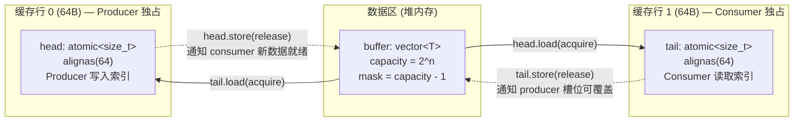
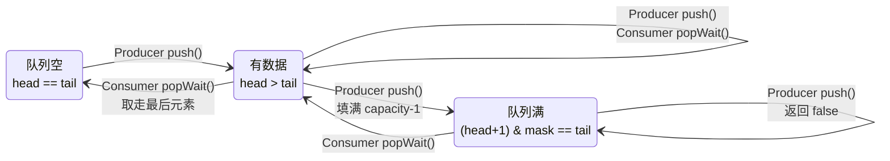

# 无锁内存模型规约

## 1. 热路径组件清单

以下组件在数据面热路径（捕获 → 分发 → 解析 → 检测）中运行，全程零 mutex：

| 组件 | 文件 | 并发模式 | 内存序策略 |
|------|------|----------|-----------|
| `SPSCQueue<RawPacket>` | `common/queues/SPSCQueue.h` | 单生产者 / 单消费者 | `acquire` / `release` |
| `ObjectPool<MemoryBlock>` | `common/memory/ObjectPool.h` | 多生产者 / 多消费者（无锁栈） | CAS + Tagged Pointer |
| `atomic<shared_ptr<EngineState>>` | `engine/flow/SecurityEngine.h:58` | 单写者 / 多读者（快照） | `acquire` / `release` |
| `atomic<shared_ptr<const unordered_set<>>>` | `engine/flow/SecurityEngine.h:65` | Copy-on-Write | `acquire` / `release` |
| `GlobalStats` | `common/types/GlobalStats.h` | 多写者（原子累加） | `relaxed` |

**非热路径 mutex**（不在检测管线内）——见第 8 节。

---

## 2. SPSCQueue — 内存序逐行分析

源码：`libsentinel/src/common/queues/SPSCQueue.h:11-57`

### 2.0 环形缓冲区内存布局



**状态机视角**：



```cpp
template <typename T> class SPSCQueue {
    std::vector<T> buffer;
    const size_t mask;
    alignas(64) std::atomic<size_t> head{0};  // producer 写入索引
    alignas(64) std::atomic<size_t> tail{0};  // consumer 读取索引
};
```

### 2.1 `push(T value)` — 生产者

```cpp
bool push(T value) {
    size_t h = head.load(std::memory_order_relaxed);  // (1)
    size_t t = tail.load(std::memory_order_acquire);  // (2)
    if (((h + 1) & mask) == t) return false;          // 队列满
    buffer[h] = std::move(value);                     // (3) 数据写入
    head.store((h + 1) & mask, std::memory_order_release); // (4)
    return true;
}
```

| 行 | 操作 | 内存序 | 理由 |
|----|------|--------|------|
| (1) | `head.load` | `relaxed` | 单生产者独写 `head`，无需同步其他 producer |
| (2) | `tail.load` | `acquire` | 与 consumer 的 `release` 配对。保证可见：consumer 已读取的槽位 = 可安全覆盖。`acquire` 确保 consumer 对 `buffer[t]` 的读取在本次 `push` 写入之前完成 |
| (3) | `buffer[h] = move` | — | 普通写入。`head.store(release)` 保证此写入在下一条之前对所有线程可见 |
| (4) | `head.store` | `release` | 与 consumer 的 `acquire` 配对。保证 buffer[h] 的内容对 consumer 可见 |

### 2.2 `popWait(timeout)` — 消费者

```cpp
std::optional<T> popWait(std::chrono::milliseconds timeout) {
    size_t t = tail.load(std::memory_order_relaxed);  // (5)
    // spin-wait loop ...
    size_t h = head.load(std::memory_order_acquire);  // (6)
    T value = std::move(buffer[t]);                   // (7) 数据读取
    tail.store((t + 1) & mask, std::memory_order_release); // (8)
    return value;
}
```

| 行 | 操作 | 内存序 | 理由 |
|----|------|--------|------|
| (5) | `tail.load` | `relaxed` | 单消费者独写 `tail`，无需同步其他 consumer |
| (6) | `head.load` | `acquire` | 与 producer 的 `release` 配对。保证 producer 的 buffer 写入对 consumer 可见 |
| (7) | `buffer[t] = move` | — | 在 `acquire` 之后，producer 的写入已全部可见 |
| (8) | `tail.store` | `release` | 与 producer 的 `acquire` 配对。保证 consumer 已完成读取，槽位可被 producer 覆盖 |

### 2.3 容量约束

- `capacity` 必须为 2 的幂（`(capacity & (capacity - 1)) == 0`）
- 构造函数中通过 `std::invalid_argument` 校验
- 位掩码 `mask = capacity - 1` 替代取模运算
- 单生产者 / 单消费者前提：违反此约束导致数据竞争，行为未定义

### 2.4 伪共享防护

```cpp
alignas(64) std::atomic<size_t> head{0};
alignas(64) std::atomic<size_t> tail{0};
```

`head` 和 `tail` 各自独占 64 字节缓存行。producer 仅写 `head`、consumer 仅写 `tail`，两者不会因缓存一致性协议互相 invalidate 对方缓存行。

---

## 3. ObjectPool — Tagged Pointer ABA 防护

源码：`libsentinel/src/common/memory/ObjectPool.h:12-123`

### 3.1 核心结构

```cpp
struct alignas(16) TaggedHead {
    PoolBlock* ptr = nullptr;   // 空闲链表头指针
    std::uint64_t tag = 0;      // 版本计数器（单调递增）
};
alignas(64) std::atomic<TaggedHead> freeHead_{TaggedHead{nullptr, 0}};
```

### 3.2 `popFree_()` — CAS 弹出

```cpp
PoolBlock* popFree_() noexcept {
    TaggedHead head = freeHead_.load(std::memory_order_acquire);  // (A)
    while (head.ptr) {
        PoolBlock* node = head.ptr;
        TaggedHead next{node->next, head.tag + 1};               // (B)
        if (freeHead_.compare_exchange_weak(head, next,          // (C)
                std::memory_order_acq_rel, std::memory_order_acquire)) {
            node->next = nullptr;
            return node;
        }
    }
    return nullptr;
}
```

| 行 | 操作 | 内存序 | 理由 |
|----|------|--------|------|
| (A) | `load` | `acquire` | 与释放线程的 `release` 配对，保证 `node->next` 可见 |
| (B) | `tag + 1` | — | 每次操作递增 tag，使 CAS 的 `(ptr, tag)` 对唯一 |
| (C) | `compare_exchange_weak` | `acq_rel`（成功）/ `acquire`（失败） | 成功时 release 语义使本线程的 node 读取对其他线程可见；失败时 acquire 重读最新值 |

### 3.3 ABA 场景推演

```
时刻 T0: freeHead = {ptr: X, tag: N}
T1: Thread A 执行 (A)，读到 head = {X, N}
T2: Thread A 被抢占
T3: Thread B 执行 popFree → pop X → pushFree(X)
    此时 freeHead = {ptr: X, tag: N+1}
T4: Thread C 执行 popFree → pop X → pushFree(X)
    此时 freeHead = {ptr: X, tag: N+2}
T5: Thread A 恢复，执行 CAS({X, N}, {X->next, N+1})
    CAS 比较: 期望 head = {X, N}，实际 head = {X, N+2}
    → 指针相同但 tag 不同 → CAS 失败 → 重试
    → 避免了将已释放并重新分配的 X 再次弹出
```

无 tag 时，Thread A 的 CAS 会在 T5 成功，导致 X 被双重弹出 → 数据竞争 / use-after-free。

### 3.4 `pushFree_()` — CAS 压入

```cpp
void pushFree_(PoolBlock* node) noexcept {
    TaggedHead head = freeHead_.load(std::memory_order_acquire);
    for (;;) {
        node->next = head.ptr;
        TaggedHead next{node, head.tag + 1};
        if (freeHead_.compare_exchange_weak(head, next,
                std::memory_order_release, std::memory_order_acquire)) {
            return;
        }
    }
}
```

`release` 语义保证 `node->next` 的更新对其他线程的 `popFree_` 可见。

### 3.5 非热路径 mutex

```cpp
std::mutex m_allocMutex_;  // ObjectPool.h:85
```

仅在 `allocateOne_()` 中触发——当空闲链表为空（池耗尽）时动态分配新节点。正常运行时不会触发此路径。

---

## 4. `atomic<shared_ptr<EngineState>>` — 快照模式

源码：`SecurityEngine.h:58,65-67`、`SecurityEngine.cpp:42-67`

### 4.1 写路径（`compileRules()`）

```
compileRules()
  ├── 拷贝 pendingRules（持有 pendingMutex）           // 锁内，短暂
  ├── new EngineState                                  // 锁外，可耗时
  │     ├── new AhoCorasick
  │     ├── for rule: acDetector->insert()
  │     └── acDetector->build()
  └── currentState.store(newState, memory_order_release) // 原子切换
```

**关键设计**：AC 自动机构建（`insert` + `build`）在锁外执行，不阻塞 `addRule()` 等控制面操作。构建完成后通过 `store(release)` 使所有读者在下一次 `load(acquire)` 后可见新快照。

旧 `shared_ptr` 在 `newState` 赋值后引用计数递减 → 若为最后一个引用则析构 `EngineState` + 递归析构 `AhoCorasick` 全部节点。

### 4.2 读路径（`getSnapshot()` / `inspect()`）

```cpp
std::shared_ptr<EngineState> SecurityEngine::getSnapshot() const {
    return currentState.load(std::memory_order_acquire);
}
```

- 返回 `shared_ptr` 副本 → 引用计数 +1 → 快照在读者持有期间不会被析构
- `acquire` 语义保证 `EngineState` 内部所有指针（`rulesMap`、`rules`、`acDetector`）已完全构造
- 读者不修改 `EngineState` 的任何字段（immutable 约定，C++ `const` 不跨 `shared_ptr` 传递——依赖代码纪律）

### 4.3 Pipeline 中的典型使用

```cpp
// PacketPipeline.cpp:70,85,105
auto stateSnapshot = SecurityEngine::instance().getSnapshot();  // 初始快照
while (running) {
    // ... popWait ...
    if (elapsedMs > 150) {
        stateSnapshot = SecurityEngine::instance().getSnapshot(); // 刷新快照
    }
    auto alert = SecurityEngine::instance().inspectFast(parsed, stateSnapshot.get());
}
```

规则热重载不影响正在进行的匹配：Pipeline 在 150ms 间隔刷新时才获取新快照。

---

## 5. IP 黑名单 — Copy-on-Write 快照

源码：`SecurityEngine.h:65-66`、`SecurityEngine.cpp:129-146`

```cpp
std::atomic<std::shared_ptr<const std::unordered_set<uint32_t>>> m_blacklistSnapshot;

void SecurityEngine::blockIp(uint32_t ip) {
    auto oldSnapshot = m_blacklistSnapshot.load(std::memory_order_acquire);
    auto newSet = std::make_shared<std::unordered_set<uint32_t>>(*oldSnapshot);
    newSet->insert(ip);
    m_blacklistSnapshot.store(std::move(newSet), std::memory_order_release);
}
```

**注意**：并发 `blockIp` / `unblockIp` 调用可能丢失更新（无合并逻辑）。调用方需外部串行化。

---

## 6. GlobalStats — Relaxed 原子计数器

源码：`libsentinel/src/common/types/GlobalStats.h:9-36`

```cpp
struct GlobalStats {
    std::atomic<uint64_t> packets_received{0};
    std::atomic<uint64_t> packets_dropped{0};
    std::atomic<uint64_t> bytes_received{0};

    void recordReceived(uint64_t bytes) {
        packets_received.fetch_add(1, std::memory_order_relaxed);
        bytes_received.fetch_add(bytes, std::memory_order_relaxed);
    }

    void snapshot(uint64_t& out_recv, uint64_t& out_drop, uint64_t& out_bytes) const {
        out_recv = packets_received.load(std::memory_order_relaxed);
        out_drop = packets_dropped.load(std::memory_order_relaxed);
        out_bytes = bytes_received.load(std::memory_order_relaxed);
    }
};
```

**全 `relaxed` 理由**：三个计数器相互独立，无因果依赖。调用方（Go Dashboard）不要求计数器间精确一致——`snapshot()` 返回的三个值可能来自不同时刻，但这对统计面板可接受。`fetch_add` 保证原子递增，不需要 ordering 保证计数器间偏序。

---

## 7. CPU 亲和性绑定

```cpp
// PacketPipeline.cpp:60-64
if (m_coreId >= 0) {
    cpu_set_t cpuset;
    CPU_ZERO(&cpuset);
    CPU_SET(m_coreId, &cpuset);
    pthread_setaffinity_np(pthread_self(), sizeof(cpu_set_t), &cpuset);
}
```

- 核心 0：保留给捕获线程 + OS 调度
- 核心 1..N：每个 Pipeline 工作线程独占一个核心
- Pipeline 线程绑定在 `run()` 入口执行，早于任何队列操作

**性能意义**：配合 SPSC 队列的 `alignas(64)` 缓存行对齐，producer 和 consumer 在不同核心上各自独占缓存行，消除跨核心缓存一致性流量。

---

## 8. 非热路径 Mutex 清单（完整性）

| 位置 | 锁类型 | 保护对象 | 触发频率 | 路径类型 |
|------|--------|----------|----------|----------|
| `SecurityEngine::pendingMutex` | `std::mutex` | `pendingRules` 向量 | 规则 CRUD（低频） | 控制面 |
| `DatabaseManager::queueMutex` | `std::mutex` | `alertQueue`（告警缓冲队列） | 每条告警一次 | I/O 线程 |
| `DatabaseManager::dbMutex` | `std::mutex` | SQLite 数据库句柄 | 每次 SQL 操作 | I/O 线程 |
| `PcapCapture::handleMutex` | `std::shared_mutex` | `pcap_t*` 句柄 | setFilter / stop（低频） | 控制操作 |
| `ForensicWorker::bufferMutex_` | `std::mutex` | `packetBuffer_` 取证缓冲 | 高危告警触发时 | 后台线程 |
| `ObjectPool::m_allocMutex_` | `std::mutex` | `allBlocks_` 全局列表 | 仅池耗尽时 | 降级路径 |
| `Logger::m_mutex` | `std::mutex` | std::cerr 输出流 | 日志输出时 | 调试路径 |
| `AuditLogger::mutex_` | `std::mutex` | 审计记录容器 | 审计写入时 | 离线路径 |
| Go `engineCreateMu` | `sync.Mutex` | 引擎创建串行化 | 启动时一次 | 控制面 |
| Go `Dashboard.mu` | `sync.Mutex` | alert 环形缓冲区 | 每条告警一次 | 渲染路径 |
