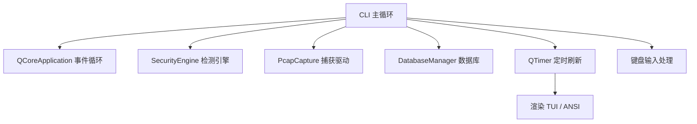

# CLI 守护进程设计

## 概述

Sentinel-Flow 支持在无图形界面的服务器环境（如 SSH 会话）中运行，通过终端提供实时监控和控制功能。CLI 模式基于 `CliEngineManager` 类实现，利用 `ncurses` 库（若可用）构建 TUI 界面，否则降级为 ANSI 终端输出，实现跨平台兼容。

## 设计目标

- **无图形依赖**：可在最小化安装的 Linux 服务器上运行。
- **实时监控**：显示流量统计、告警信息、规则状态。
- **交互控制**：支持热键操作（重载规则、导入规则、清空告警等）。
- **资源高效**：采用异步 I/O 和定时刷新，避免阻塞。

## 架构设计



## 初始化流程

`CliEngineManager::start()` 执行以下步骤：

1. **引擎初始化**：
    - 调用 `SecurityEngine::instance().compileRules()` 加载规则。
    - 初始化 `DatabaseManager`，连接数据库。
2. **捕获队列设置**：
    - 根据 CPU 核心数确定工作线程数（`workerCount`）。
    - 创建对应数量的 `SPSCQueue` 和 `PacketPipeline`。
    - 设置每个管线的核心亲和性（可选）。
    - 连接信号槽（`packetsProcessed` → `handlePackets`，`threatDetected` → `onThreatDetected`）。
3. **启动捕获**：
    - 获取第一个可用网卡，调用 `PcapCapture::instance().start(device)`。
4. **UI 初始化**：
    - 若检测到 `HAVE_CURSES`，初始化 `ncurses` 窗口布局。
    - 否则使用 ANSI 转义序列输出。
5. **定时器启动**：
    - 创建 `QTimer`，间隔 250ms（ncurses）或 1000ms（ANSI）触发 `renderTui()`。

## ncurses 实现

### 窗口布局

```cpp
    // 创建窗口
    headerWin   = newwin(HEADER_HEIGHT, cols, 0, 0);
    modulesWin  = newwin(MODULES_HEIGHT, cols, HEADER_HEIGHT, 0);
    int midY = HEADER_HEIGHT + MODULES_HEIGHT;
    int alertsHeight = rows - (HEADER_HEIGHT + MODULES_HEIGHT + FOOTER_HEIGHT);
    alertsWin  = newwin(alertsHeight, cols, midY, 0);
    footerWin  = newwin(FOOTER_HEIGHT, cols, rows - FOOTER_HEIGHT, 0);
```

- **Header**：显示标题和版本。
- **Modules**：显示工作线程数、状态、当前网卡。
- **Alerts**：流量统计、告警列表。
- **Footer**：命令帮助。

### 键盘输入处理

```cpp
    int ch = wgetch(stdscr);
    if (ch != ERR) {
        if (ch == 'q' || ch == 'Q') {
            // 优雅退出
            for (auto* pipe : pipelinePool) pipe->stopPipeline();
            PcapCapture::instance().stop();
            QCoreApplication::quit();
        } else if (ch == 'r' || ch == 'R') {
            SecurityEngine::instance().compileRules();
            // 记录日志
        } else if (ch == 'c' || ch == 'C') {
            latestAlerts.clear();
            alertsCritical = alertsHigh = alertsMedium = alertsLow = alertsInfo = 0;
        } else if (ch == 'd' || ch == 'D') {
            showDetail = !showDetail;
        } else if (ch == 'i' || ch == 'I') {
            // 弹出输入框，获取规则文件路径
        }
    }
```

### 实时数据更新

- 使用 `std::atomic` 计数器统计各级别告警数量。
- 告警队列 `latestAlerts` 保存最近 100 条，通过 `std::deque` 管理。
- 渲染时使用 `mvwprintw` 写入窗口，然后 `wrefresh` 刷新。

## ANSI 回退模式

当 `HAVE_CURSES` 未定义时，系统使用纯文本输出和 ANSI 转义序列实现简单界面：

```cpp
    static void ansi_clear() { std::cout << "\033[2J\033[H"; }
    static void ansi_header() {
        std::cout << "\033[1;36m======================================================================\n";
        std::cout << " Sentinel-Flow v1.0 [CLI Mode] - 高性能网络安全引擎 (Headless)\n";
        std::cout << "======================================================================\033[0m\n";
    }
```

- **定时刷新**：每秒清屏并重新输出统计信息。
- **命令输入**：通过 `std::cin` 读取用户输入，支持 `r`、`c`、`d`、`i`、`q` 等命令。
- **非阻塞输入**：使用 `select()` 检测标准输入是否有数据，避免阻塞主循环。

## 信号槽连接

### 流量统计

```cpp
    connect(pipe, &PacketPipeline::packetsProcessed, this, 
            [this](QSharedPointer<QVector<ParsedPacket>> packets) { handlePackets(packets); });
```

- `handlePackets` 更新 `totalPackets` 计数。

### 告警处理

```cpp
    connect(pipe, &PacketPipeline::threatDetected, this, &CliEngineManager::onThreatDetected);
```

- 在 `onThreatDetected` 中增加对应等级的原子计数器，并将告警信息格式化后插入 `latestAlerts` 头部。

## 规则导入与重载

- **重载规则**：按 `r` 键触发 `SecurityEngine::compileRules()`，重新构建 AC 自动机。
- **导入规则**：按 `i` 键弹出路径输入框，读取 Snort 格式规则文件，解析后添加至引擎（同 GUI 逻辑）。

## 性能与资源

- **线程模型**：与 GUI 模式相同，使用独立的解析线程池，CLI 主线程仅负责渲染和输入处理。
- **内存占用**：比 GUI 模式更小，无需加载 Qt 图形库（但需链接 QtCore）。
- **CPU 占用**：渲染定时器周期较长（250ms/1s），几乎不消耗 CPU。

## 使用示例

```bash
    # 启动 CLI 模式（交互式）
    ./SentinelApp --cli
    
    # 直接进入 CLI（跳过启动菜单）
    ./SentinelApp --cli
```

启动后界面示例：

```
    ======================================================================
     Sentinel-Flow v1.0 [CLI Mode] - 高性能网络安全引擎
    ======================================================================
    Workers: 4  |  Status: RUNNING  |  Interface: eth0
    PCAP: OK  DB: OK
    
    Traffic: Packets Parsed: 1234567    Rules: builtin (1523)
    Alerts - C:0 H:12 M:34 L:56 I:78
    
    [11:23:45] [HIGH] 192.168.1.100:54321 -> 8.8.8.8:443 [RULE-1001] Suspicious TLS fingerprint
    [11:23:44] [MEDIUM] 10.0.0.5:12345 -> 192.168.1.1:80 [RULE-2002] HTTP request contains malware pattern
    ...
    
    Commands: r=reload rules  i=import rules  c=clear alerts  d=toggle detail  q=quit
    Press the corresponding key to execute command.
```

## 扩展性

- **增加新命令**：在键盘处理分支中添加对应逻辑。
- **支持更多统计**：可在 `renderTui` 中扩展显示内容（如协议分布、CPU 使用率等）。
- **远程监控**：可通过管道或日志文件输出，便于集成到监控系统。

## 注意事项

- `ncurses` 模式下，终端需支持光标隐藏、颜色等特性。
- 若终端窗口大小改变，`ncurses` 需要重新调整窗口（当前版本未实现，可后续增强）。
- ANSI 模式下的命令输入可能与系统输出交错，建议在低交互场景使用。

---
