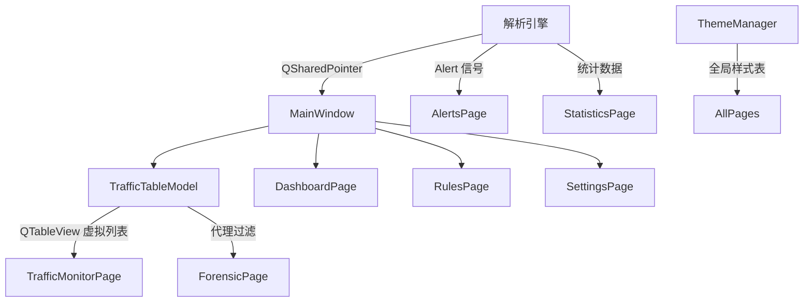

# Qt6 渲染引擎设计

## 概述

Sentinel-Flow 的前端基于 Qt6 框架构建，采用 MVC 架构，将数据模型与视图严格分离。通过批量数据投递、虚拟列表渲染、自定义图表组件和动态主题系统，实现高性能的网络流量可视化。所有 UI 交互均设计为无阻塞模式，确保实时数据流不干扰用户操作。

## 整体架构



## 主窗口设计

### MainWindow 结构

- **侧边栏**：`QPushButton` 组，用于页面切换。
- **内容区**：`QStackedWidget` 管理各个页面。
- **主题切换**：通过 `SettingsPage` 触发，`ThemeManager` 全局应用。

### 页面组织

| 页面 | 类名 | 功能 |
|------|------|------|
| 态势感知 | `DashboardPage` | 健康评分、威胁时间轴、系统监控 |
| 流量监控 | `TrafficMonitorPage` | 实时流量表、协议树、十六进制视图 |
| 安全告警 | `AlertsPage` | 告警列表、详情展示、导出 |
| 统计分析 | `StatisticsPage` | 速率图表、协议分布、活跃主机 |
| 离线取证 | `ForensicPage` | PCAP 加载、批量解析、深度分析 |
| 规则策略 | `RulesPage` | BPF 过滤、IDS 规则、黑名单、协议控制 |
| 全局设置 | `SettingsPage` | 引擎配置、外观主题、存储维护 |

## 数据模型与视图

### TrafficTableModel

继承自 `QAbstractTableModel`，管理 `std::deque<ParsedPacket>` 和重复计数。

```cpp
    class TrafficTableModel : public QAbstractTableModel {
    public:
        void addPackets(const std::vector<ParsedPacket>& packets);
        void updateLastPacket(const ParsedPacket& packet, int repeatCount);
        const ParsedPacket* getPacketAt(int row) const;
    private:
        std::deque<ParsedPacket> m_packetList;
        std::deque<int> m_repeatCounts;
        const size_t m_maxRows = 100000;
    };
```

**关键特性**：
- **循环队列**：超过 10 万行自动删除最旧数据。
- **重复行合并**：相同源/目的 IP 和协议的行可合并，显示重复次数。
- **快速访问**：通过行号直接获取 `ParsedPacket*`。

### QTableView 虚拟列表

- 仅渲染可见行，支持海量数据（10 万+）流畅滚动。
- 自定义列宽、排序、过滤代理。
- 选中行时动态更新详情视图。

### 代理过滤模型

`TrafficProxyModel` 继承 `QSortFilterProxyModel`，支持：
- 按协议过滤（TCP/UDP/HTTP/TLS/ICMP）。
- 按关键字过滤（IP、端口、协议、载荷内容）。

## 自定义组件

### 图表组件

#### TrafficWaveChart

实时波形图，使用 `QSplineSeries` 和 `QAreaSeries` 实现平滑曲线和渐变填充。

```cpp
    void TrafficWaveChart::pushData(double speedKB) {
        // 平移数据，插入新点
        // 动态调整 Y 轴范围
        m_series->replace(m_dataBuffer);
    }
```

- 保持 60 个数据点，支持动态缩放 Y 轴。
- 深色/浅色主题自动切换颜色。

#### ThreatTimelineWidget

威胁时间轴，使用 `QScatterSeries` 绘制不同级别的告警点，X 轴为时间，Y 轴为威胁等级。

- 支持清除、滚动窗口（1 分钟）。
- 事件点大小随等级变化。

### StatCard

卡片式指标组件，支持状态颜色（Normal/Success/Warning/Danger），值自动格式化。

### PacketDetailRenderer

静态渲染器，生成 Wireshark 风格的协议树和十六进制转储。

```cpp
    static void render(const ParsedPacket* pkt, QTextEdit* hexView, QTreeWidget* protoTree, QLabel* summaryLabel);
```

- 自动识别 HTTP/TLS 并提取关键字段。
- 二进制载荷智能判断：可打印字符 > 35% 则显示文本，否则显示十六进制。
- 支持复制十六进制流、可打印文本等上下文菜单。

### UIFactory

工厂类，用于创建统一样式的信息框、提示组件等。

## 跨线程通信

### 批量投递

解析线程通过信号 `packetsProcessed(QSharedPointer<QVector<ParsedPacket>>)` 将一批数据发送到 UI 线程。

```cpp
    // 解析线程
    if (packetBatch.size() >= 5000 || timer.elapsed() > 150) {
        emit packetsProcessed(QSharedPointer<QVector<ParsedPacket>>::create(std::move(packetBatch)));
    }
```

- 使用 `QSharedPointer` 避免数据拷贝。
- 批量投递减少信号数量，降低主线程事件处理压力。

### 异步处理

UI 线程接收信号后，将数据推入待处理队列，由定时器驱动消费：

```cpp
    void TrafficMonitorPage::processPendingPackets() {
        // 每次处理限制时间（5ms），防止阻塞事件循环
        while (!pendingPackets.empty() && timer.elapsed() < 5) {
            // 处理数据
        }
    }
```

- 限时处理避免界面卡顿。
- 支持“暂停”功能，挂起数据追加。

## 主题系统

### ThemeManager

全局主题管理器，通过设置 `QPalette` 和样式表切换深色/浅色主题。

```cpp
    void ThemeManager::applyTheme(QApplication& app, bool isDark) {
        g_isDarkMode = isDark;
        // 设置调色板
        QPalette p;
        // ...
        app.setPalette(p);
        app.setStyleSheet(Style::getGlobalStyle());
    }
```

- 使用 `g_isDarkMode` 全局标志，便于样式表动态选择颜色。
- 样式表定义在 `ThemeDefinitions.h` 中，按深色/浅色分离。

### 动态样式切换

每个页面实现 `onThemeChanged()` 槽函数，响应主题变化：

```cpp
    void StatisticsPage::onThemeChanged() {
        setTheme(g_isDarkMode);  // 刷新图表颜色
    }
```

- 主题变化时，`SettingsPage` 发送 `themeChanged(bool)` 信号，`MainWindow` 转发给所有页面。
- 组件内部通过 `g_isDarkMode` 实时调整颜色（如 `TrafficWaveChart`）。

### 样式表设计原则

- **使用对象名称和属性选择器**：如 `QWidget#Sidebar`、`QPushButton[type="primary"]`，便于模块化。
- **颜色动态化**：通过 `QPalette` 设置基础色，样式表中使用 `palette()` 函数引用。
- **支持角色**：`QLabel[role="title"]`、`QLabel[role="value"]` 统一定义字体和颜色。

## 性能优化策略

| 策略 | 实现 |
|------|------|
| 批量更新模型 | `beginInsertRows` / `endInsertRows` 一次性插入多条 |
| 延迟刷新 | 过滤输入使用防抖定时器（300ms） |
| 虚拟滚动 | `QTableView` 默认支持 |
| 限时处理 | 每帧最多处理 5ms 数据，避免 UI 卡顿 |
| 智能合并 | 相邻重复行合并，减少模型行数 |
| 透明背景 | 图表和文本编辑区设置透明背景，减少绘制开销 |

## 用户体验增强

- **右键菜单**：十六进制视图支持复制为 Hex Stream、Hex Dump、Printable Text。
- **自动滚动**：开启后新数据自动滚动到底部，鼠标悬停时暂停。
- **导出功能**：支持将流量表导出为 CSV/JSON 格式。
- **快捷键**：CLI 模式下支持 r/c/d/q 等快速命令。

## 使用示例

### 添加新页面

1. 创建页面类继承 `QWidget`。
2. 在 `MainWindow` 中实例化并加入 `QStackedWidget`。
3. 在侧边栏添加按钮，连接信号槽切换索引。
4. 实现 `onThemeChanged()` 支持主题切换。

### 自定义主题

在 `ThemeDefinitions.h` 的 `Dark`/`Light` 命名空间中添加样式表规则，使用选择器定位组件。

---
